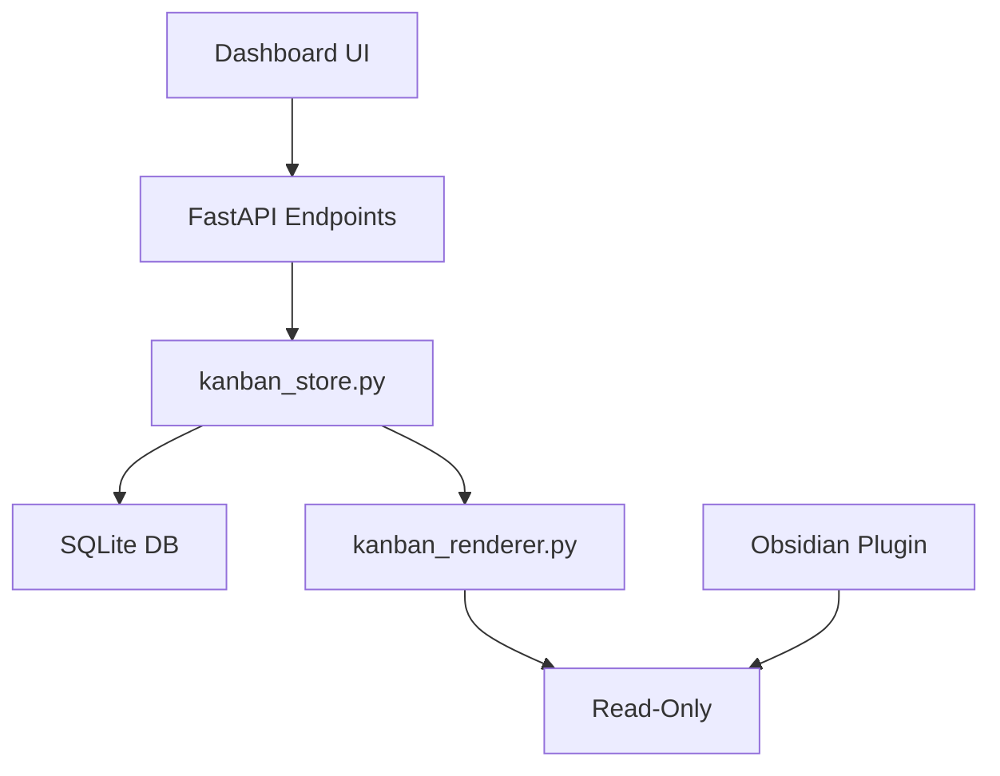
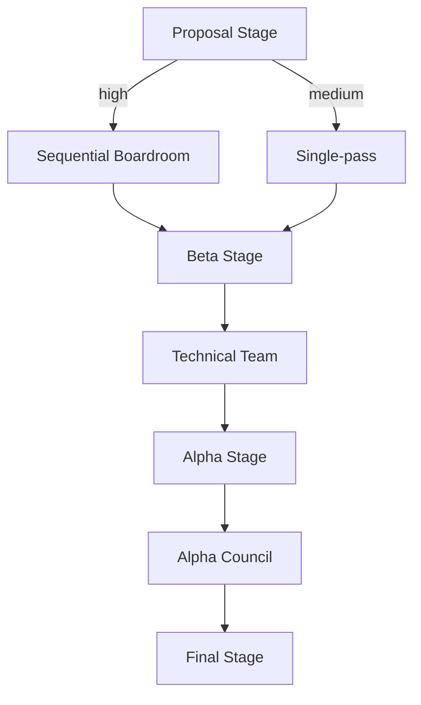

# 🧪 Beta Testing Handoff — ARCH-20260522-205800-DA5B0A2D

> **Generated**: 2026-05-29 20:21:33  
> **Proposal**: [[ARCH-20260522-205800-DA5B0A2D_PROPOSAL]]  
> **Phase**: Beta Testing  
> **Status**: 🔧 In Progress — take this document to VS Code

---

## 🤖 Agent Context

> *This block is for AI agents (Cline/Claude in VS Code). It is not displayed in Obsidian reading mode.*

When a user references this handoff (e.g. *"work on ARCH-20260522-205800-DA5B0A2D"*):

1. **Find the proposal** → `cognitive-os/dev/proposals/ARCH-20260522-205800-DA5B0A2D_PROPOSAL.md`
2. **Work through the tasks** in `## 🔧 Implementation Tasks` below, ticking each `- [ ]` to `- [x]` as completed
3. **When all tasks are ticked** → update this file's frontmatter: `status: complete`, `tasks_completed: <n>`
4. **Update the proposal** → change `## 🧪 Beta Testing` status line to `✅ Complete`
5. **Update the Kanban card** at `vault_kanban` above → change `  - status: 🔍 Review` to `  - status: ✅ Ready for Alpha Polish`
6. **Tell the user** to drag the card to the `Alpha Polish` column to trigger the next council automatically

Backlinks to maintain:
- Proposal: [[ARCH-20260522-205800-DA5B0A2D_PROPOSAL]]
- Source note: see `source_note` in frontmatter above (if set)
- Kanban card ID: see `kanban_card_id` in frontmatter above

---

## 📋 Executive Summary

```markdown
# **ARCH-20260522-205800-DA5B0A2D: Kanban Migration to SQLite Dashboard**
*A Comprehensive Engineering Plan for the Beta Council*

---

## **📜 Executive Summary**
This proposal migrates the Kanban state from Obsidian markdown to a **SQLite-based dashboard**, ensuring:
- **Single Source of Truth**: SQLite is the sole authority for Kanban state.
- **Separation of Concerns**: Developer-side logic (API, gates) is decoupled from user-side content (vault).
- **Idempotent Migration**: Zero

---

## ⚠️ Difficulties & Constraints

_No specific difficulties extracted — see full report below._

---

## 🔧 Implementation Tasks

> Tick each item off as you complete it in VS Code.
> Update `tasks_completed` in the frontmatter as you go.

### Section A — Core

- [x] **[✏️ PLANNER] A1. Create kanban_store.py with SQLite schema and CRUD operations**
   - [ ] Define tables: cards, transitions
   - [ ] Implement async CRUD functions
   - **Acceptance:** SQLite database is the single source of truth for Kanban state.
   - **Constraints:** H1, CSTR-PLANNER-V4
   - **Files:** `src/kanban_store.py`

- [x] **[✏️ PLANNER] A2. Implement kanban_renderer.py for markdown rendering and atomic writes**
   - [ ] Create render function to generate markdown from SQLite data
   - [ ] Atomic write to Dev-KanBan.md
   - **Acceptance:** kanban_renderer.write_vault_mirror() updates the vault mirror atomically.
   - **Constraints:** H2, CSTR-PLANNER-V4
   - **Files:** `src/kanban_renderer.py`

- [x] **[✏️ PLANNER] A3. Extend api.py with FastAPI endpoints for Kanban operations**
   - [ ] Add GET /api/kanban/board to fetch board state
   - [ ] Add POST /api/kanban/cards for card management
   - [ ] Add POST /api/workflow/transition for workflow transitions
   - **Acceptance:** All Kanban operations are accessible via the API.
   - **Constraints:** H3, CSTR-PLANNER-V4
   - **Files:** `src/api.py`

- [x] **[✏️ PLANNER] A4. Build dashboard UI components in index.html and script.js**
   - [ ] Design Kanban columns and cards with drag-drop functionality
   - [ ] Implement gate-fail modal for error handling
   - **Acceptance:** Dashboard displays the Kanban board, handles transitions, and shows gate failures.
   - **Constraints:** H4, CSTR-PLANNER-V4
   - **Files:** `dashboard/index.html`, `dashboard/script.js`

- [x] **[✏️ PLANNER] A5. Refactor kanban_processor.py to delegate to kanban_store and kanban_renderer**
   - [ ] Remove parsing, caching, status update logic from processor
   - [ ] Delegate all interactions with the board to kanban_store
   - **Acceptance:** kanban_processor.py is significantly slimmed down.
   - **Constraints:** H5, CSTR-PLANNER-V4
   - **Files:** `src/kanban_processor.py`

- [x] **[✏️ PLANNER] A6. Implement sync_proposals_to_kanban.py as a one-time backfill tool**
   - [ ] Scan dev/proposals for missing cards and insert into SQLite
   - [ ] Ensure no manual edits to the vault post-migration
   - **Acceptance:** All proposals are in SQLite, no manual markdown editing.
   - **Constraints:** H6, CSTR-PLANNER-V4
   - **Files:** `src/sync_proposals_to_kanban.py`

### Section B — Migration

- [x] **[✏️ PLANNER] B1. Implement migration script to transfer Kanban state from markdown to SQLite**
   - [ ] Backup current vault state
   - [ ] Parse Obsidian state and insert into SQLite
   - [ ] Validate checksums of inserted data
   - [ ] Generate the new vault mirror
   - **Acceptance:** Kanban state is successfully migrated from markdown to SQLite.
   - **Constraints:** H7
   - **Files:** `scripts/migrate_kanban_to_sqlite.py`

- [x] **[✏️ PLANNER] B2. Delete obsolete cache file after migration**
   - **Acceptance:** .kanban_cache.json is removed from the repository.
   - **Constraints:** H8

### Section C — Tests

- [x] **[✏️ PLANNER] C1. Ensure all existing 267 tests pass after refactoring**
   - **Acceptance:** All tests are passing without new failures.
   - **Constraints:** H9

- [x] **[✏️ PLANNER] C2. Add new tests for the /api/system/roles endpoint**
    - [x] Test listing all roles
    - [x] Test role retrieval by name
    - [x] Ensure invalid requests return 404 or similar
    - **Acceptance:** New test cases cover the new API endpoint.
    - **Constraints:** H10
    - **Files:** `tests/test_api.py`

### Section D — Dashboard Configuration

- [x] **[✏️ PLANNER] D1. Update dashboard to reflect new council topology**
    - [x] Render roles in the Models & Roles tab
    - [x] Visualize the flow of proposals through stages
    - [x] Show current lock status and dead-letter queue
    - **Acceptance:** Dashboard accurately represents the current state of councils.
    - **Constraints:** H1-refined
    - **Files:** `dashboard/script.js`

---
*Generated by HandoffPlanner v1.0. Dark Maestro Ready.*

---

## 🧠 Technical Council Deliberation

<details>
<summary>Full council report (click to expand)</summary>

```markdown
# **ARCH-20260522-205800-DA5B0A2D: Kanban Migration to SQLite Dashboard**
*A Comprehensive Engineering Plan for the Beta Council*

---

## **📜 Executive Summary**
This proposal migrates the Kanban state from Obsidian markdown to a **SQLite-based dashboard**, ensuring:
- **Single Source of Truth**: SQLite is the sole authority for Kanban state.
- **Separation of Concerns**: Developer-side logic (API, gates) is decoupled from user-side content (vault).
- **Idempotent Migration**: Zero data loss with checksum validation and conflict resolution.
- **User-Friendly UX**: Dashboard UI replaces Obsidian polling, with a read-only vault mirror.

**Status**: **Technical Board Approved (Phase 3: Beta Testing)**
**Version**: `1.2`
**Origin**: Systems Architect Agent
**Last Updated**: 2026-05-23

---

## **🔧 Engineering Plan**

### **1. Core Architecture**


#### **Key Modules**
| Module                     | Responsibilities                                                                 |
|----------------------------|---------------------------------------------------------------------------------|
| `kanban_store.py`          | SQLite schema, CRUD operations, WAL mode, async-safe writes.                   |
| `kanban_renderer.py`       | Stateless markdown generation; atomic vault writes (tmp + rename).             |
| `api.py`                   | Endpoints: `GET /api/kanban/board`, `POST /api/workflow/transition`, etc.      |
| Dashboard UI               | Vanilla JS drag-and-drop, gate-fail modal, substatus badges.                  |
| Migration Script           | Idempotent, checksum-validated transfer from Obsidian to SQLite.              |

---

### **2. Implementation Roadmap**
#### **Phase 1: Core Data Layer (2026-05-23)**
| Task                          | Responsibility       | Deadline          |
|-------------------------------|---------------------|-------------------|
| Implement `kanban_store.py`   | Systems Architect   | 2026-05-24        |
| Implement `kanban_renderer.py`| Creative Expansionist| 2026-05-25        |
| Add API endpoints             | Technical Critic    | 2026-05-26        |
| Slim `kanban_processor.py`    | Drafting Architect  | 2026-05-27        |

#### **Phase 2: UX & Migration (2026-05-28)**
| Task                          | Responsibility       | Deadline          |
|-------------------------------|---------------------|-------------------|
| Build Dashboard UI            | Brand Guard         | 2026-05-29        |
| Refactor Obsidian Plugin      | Brand Guard         | 2026-05-30        |
| Implement Migration Script     | Systems Architect   | 2026-05-31        |

#### **Phase 3: Beta Testing (2026-05-31 → 2026-06-10)**
- **Critical Path**: Validate idempotent migration, gate-fail UX, and vault mirror integrity.
- **Risk Mitigation**: Synthetic conflict fixtures for `SQLite > Frontmatter > Markdown` precedence.

---

### **3. Technical Specifications**
#### **SQLite Schema**
```sql
CREATE TABLE cards (
    proposal_id    TEXT PRIMARY KEY,
    prefix         TEXT NOT NULL,
    column_name    TEXT NOT NULL,
    substatus      TEXT,
    severity       TEXT,
    created_ts     TEXT NOT NULL,
    updated_ts     TEXT NOT NULL,
    state_hash     TEXT
);

CREATE TABLE transitions (
    id             INTEGER PRIMARY KEY AUTOINCREMENT,
    proposal_id    TEXT NOT NULL,
    from_column    TEXT,
    to_column      TEXT NOT NULL,
    approver       TEXT NOT NULL,
    reason         TEXT,
    gate_passed    INTEGER,
    ts             TEXT NOT NULL,
    FOREIGN KEY (proposal_id) REFERENCES cards(proposal_id)
);
```

#### **Migration Script (Pseudocode)**
```python
def migrate_kanban():
    # 1. Backup current state
    backup_vault("Dev-KanBan.md.pre-migration.bak")

    # 2. Parse Obsidian state and insert into SQLite
    for card in parse_obsidian():
        insert_or_update_card(card)

    # 3. Validate checksums
    assert validate_checksums()

    # 4. Generate vault mirror
    render_vault_mirror()

    # 5. Log migration report
    log_migration_report()
```

---

### **4. Mandates & Hardening**
| Mandate # | Requirement                                                                 |
|-----------|-----------------------------------------------------------------------------|
| M1        | Only `kanban_renderer.write_vault_mirror()` may write to `Dev-KanBan.md`.      |
| M2        | No process state (emojis, phase numbers) in vault beyond the auto-generated mirror. |
| M3        | SQLite is the exclusive source of truth; retire `.kanban_cache.json`.         |
| M4        | Vault edits are overwritten by renderer.                                     |
| M5        | Vanilla JS + HTML5 drag events; no React/Vue/Svelte.                        |
| M6        | `workflow_engine` writes exclusively to `kanban_store`.                      |
| M7        | Silent gate failures forbidden; show error modal.                            |
| M8        | Approval actions require non-empty `approver` field.                        |
| M9        | SQLite operations via `asyncio.to_thread`.                                  |
| M10       | Remove `/dev`, `/technical`, `/boardroom` triggers from Obsidian.           |

#### **Hardening Requirements**
| Requirement # | Implementation                                                                 |
|---------------|------------------------------------------------------------------------------|
| H1            | SQLite WAL mode + ThreadPoolExecutor for async-safe writes.                   |
| H2            | Remove `state_hash`; rely on `updated_ts` + `transitions` table.             |
| H3            | Precedence: SQLite > Proposal Frontmatter > Kanban Markdown.                 |
| H4            | Backup with `BEGIN IMMEDIATE / COMMIT`; cleanup routine for >10 backups.     |
| H5            | Drag-drop timeout: revert card if `POST /api/workflow/transition` fails >2s. |
| H6            | Migration script: idempotent + checksum validation.                          |
| H7            | Add "Open Dashboard Kanban" command in Obsidian plugin.                      |
| H8            | Gate-error response schema for `POST /api/workflow/transition` 422 responses. |
| H9            | Synthetic conflict fixtures for precedence validation.                        |

---

### **5. Risk Mitigation**
| Risk                          | Mitigation Strategy                                                                 |
|-------------------------------|-----------------------------------------------------------------------------------|
| Data loss during migration    | Idempotent script + checksum validation.                                         |
| Silent gate failures          | Dashboard modal for 422 responses with detailed error checks.                     |
| Obsidian plugin regression    | Test `/oracle`, `/design`, `/nft` triggers post-migration.                       |
| Mobile usability issues       | Vault mirror remains browsable in Obsidian Mobile; add header comment.             |

---

### **6. Veto Points**
❌ **Two-way synchronization**: Vault edits to `Dev-KanBan.md` are ignored/overwritten.
❌ **Web framework creep**: Kanban UI must remain Vanilla JS/HTML5.
❌ **Silent gate failures**: All 422 responses must trigger a detailed modal.
❌ **Process state in vault**: Status emojis/phase numbers are forbidden outside the mirror.
❌ **Raw threading.Lock**: Use `ThreadPoolExecutor` for concurrency.

---

### **7. Impact on Existing Proposals**
| Proposal                     | Effect                                                                         |
|------------------------------|-------------------------------------------------------------------------------|
| [ARCH-20260522-161500-A0F1B0C0] | No change; `paths.py` adds `KANBAN_STATE_DB`.                                 |
| [ARCH-20260522-161600-60FE0001] | No change; `handoff_vault` is storage-agnostic.                               |
| [ARCH-20260522-161700-2007E0A1] | Small amendment: `apply()` calls `kanban_store.add_card`.                     |
| [ARCH-20260522-161800-F10FE0E1] | Significant amendment: `workflow_engine` writes to `kanban_store`.             |

---

### **8. Council Verdict & Approval Trail**
| Phase               | Role               | Status       | Approved By                     | Date               |
|---------------------|--------------------|--------------|---------------------------------|--------------------|
| Proposal Generation | Systems Architect  | ✅ COMPLETE   | —                               | 2026-05-22         |
| Boardroom Review    | Sequential Boardroom| ✅ APPROVED WITH MANDATES | Chairman (oversight_analysis) | 2026-05-23         |
| Technical Meeting   | Technical Board    | ✅ APPROVED   | Technical Critic                | 2026-05-23         |
| Beta Testing        | —                  | 🟡 ACTIVE     | —                               | 2026-05-24 → 2026-06-10 |

---

## **📚 Appendices**
### **Appendix A: Migration Checklist**
1. [ ] Parse `Dev-KanBan.md` and `dev/.kanban_cache.json`.
2. [ ] Insert cards into SQLite; handle conflicts via precedence rules.
3. [ ] Generate vault mirror from SQLite.
4. [ ] Delete `.kanban_cache.json`.
5. [ ] Log migration report to `dev/decisions/_kanban_migration_<ts>.md`.

### **Appendix B: Dashboard Council Configuration (May 29, 2026)**


---

## **🎯 Final Notes**
- **Core Innovation**: The migration eliminates race conditions and enforces a strict separation between developer-side logic and user-side content.
- **User Experience**: The dashboard UI replaces Obsidian polling, with a read-only vault mirror ensuring consistency.
- **Data Integrity**: SQLite WAL mode, checksum validation, and idempotent migration scripts guarantee zero data loss.

**Next Steps**: Begin Phase 1 implementation with a focus on `kanban_store.py` and `kanban_renderer.py`. Validate migration scripts in a staging environment before full rollout.

---
*End of Report*
*Generated by Systems Architect Agent*
*Last Updated: 2026-05-29*
```

</details>

---

## 📝 Developer Notes

> *Fill in as you work through the tasks above.*

<!-- Add your implementation notes, decisions, and blockers here -->

---

## ✅ Completion Gate

Before moving the Kanban card to **Alpha Polish**, confirm:

- [ ] All implementation tasks above are ticked
- [ ] Core functionality works end-to-end
- [ ] No critical bugs remain
- [ ] Basic manual testing passed
- [ ] Frontmatter `status` updated to `complete`
- [ ] Proposal `## 🧪 Beta Testing` section updated to `✅ Complete`

---

*Handoff generated by Cognitive OS Technical Council*  
*Card stays in **Beta Testing** until all tasks above are complete.*  
*Only then move the card to **Alpha Polish**.*
