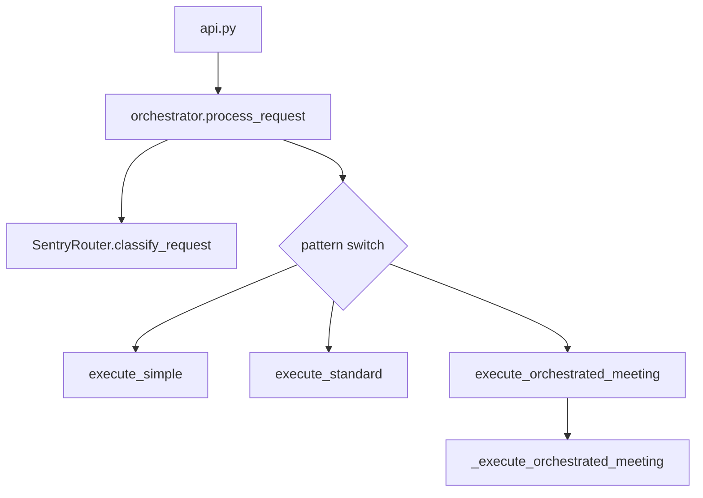
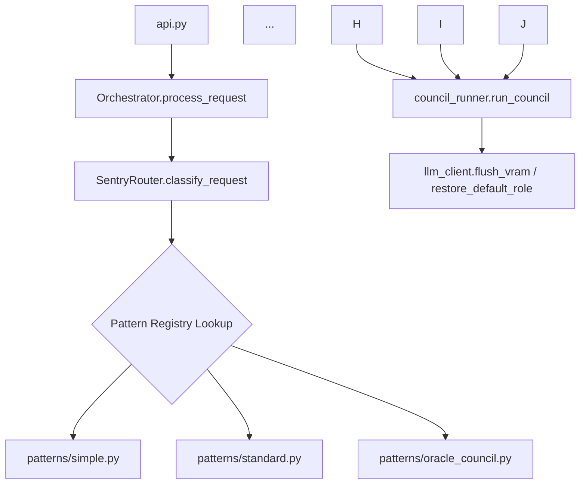

# 🧪 Beta Testing Handoff — ARCH-20260526-093000-7C4E2B91

> **Generated**: 2026-05-26 02:22:02  
> **Proposal**: [[ARCH-20260526-093000-7C4E2B91_PROPOSAL]]  
> **Phase**: Beta Testing  
> **Status**: 🔧 In Progress — take this document to VS Code

---

## 🤖 Agent Context

> *This block is for AI agents (Cline/Claude in VS Code). It is not displayed in Obsidian reading mode.*

When a user references this handoff (e.g. *"work on ARCH-20260526-093000-7C4E2B91"*):

1. **Find the proposal** → `cognitive-os/dev/proposals/ARCH-20260526-093000-7C4E2B91_PROPOSAL.md`
2. **Work through the tasks** in `## 🔧 Implementation Tasks` below, ticking each `- [ ]` to `- [x]` as completed
3. **When all tasks are ticked** → update this file's frontmatter: `status: complete`, `tasks_completed: <n>`
4. **Update the proposal** → change `## 🧪 Beta Testing` status line to `✅ Complete`
5. **Update the Kanban card** at `vault_kanban` above → change `  - status: 🔍 Review` to `  - status: ✅ Ready for Alpha Polish`
6. **Tell the user** to drag the card to the `Alpha Polish` column to trigger the next council automatically

Backlinks to maintain:
- Proposal: [[ARCH-20260526-093000-7C4E2B91_PROPOSAL]]
- Source note: see `source_note` in frontmatter above (if set)
- Kanban card ID: see `kanban_card_id` in frontmatter above

---

## 📋 Executive Summary

```markdown
---
title: "ARCH-20260526-93000-7C4E2B91 - Monolithic Orchestrator Refactoring"
author: Systems Architect Agent + Beta Council
date: 2026-05-26
status: Finalized
version: 1.0
---

# **📜 Grand Nexus Architecture Proposal Review Report**
## **Monolithic Orchestrator Decomposition into Modular Patterns**

---

## 🔍 **Proposal Overview**
**ID:** `ARCH-20260526-93000-7C4E2B91`
**Origin:** Direct Systems Architect request
**Phase:** Final Approval (Sequential Boardroom)
**Date:** 2026-05-2

---

## ⚠️ Difficulties & Constraints

_No specific difficulties extracted — see full report below._

---

## 🔧 Implementation Tasks

> Tick each item off as you complete it in VS Code.
> Update `tasks_completed` in the frontmatter as you go.

### Section A — Core

- [ ] **[✏️ PLANNER] A1. Create src/council_runner.py with run_council function**
   - [ ] Copy the moderator loop from _execute_orchestrated_meeting
   - **Acceptance:** run_council function exists in src/council_runner.py and preserves error handling.
   - **Constraints:** H3
   - **Files:** `src/council_runner.py`

- [ ] **[✏️ PLANNER] A2. Extend llm_client.py with flush_vram and restore_default_role functions**
   - [ ] Move subprocess code from _restore_default_state to llm_client.py
   - **Acceptance:** flush_vram and restore_default_role functions exist in src/llm_client.py.
   - **Constraints:** H3
   - **Files:** `src/llm_client.py`

- [ ] **[✏️ PLANNER] A3. Create patterns package and initialize PATTERN_REGISTRY**
   - [ ] Initialize an empty __init__.py in src/patterns/
   - [ ] Create one file per pattern under src/patterns/
   - **Acceptance:** src/patterns/__init__.py exports PATTERN_REGISTRY.
   - **Constraints:** CSTR-PLANNER-V4
   - **Files:** `src/patterns/__init__.py`, `src/patterns/simple.py`, `src/patterns/standard.py`, `src/patterns/oracle_council.py`

- [ ] **[✏️ PLANNER] A4. Refactor src/orchestrator.py to use PATTERN_REGISTRY**
   - [ ] Replace pattern switch with PATTERN_REGISTRY[pattern](req)
   - [ ] Remove all execute_* methods and _ helpers
   - **Acceptance:** src/orchestrator.py no longer contains any execute_* methods or _ helpers.
   - **Constraints:** CSTR-PLANNER-V4
   - **Files:** `src/orchestrator.py`

- [ ] **[✏️ PLANNER] A5. Modify src/api.py to extract PDF text before calling orchestrator.process_request**
   - [ ] Perform PDF extraction using extract_text_from_pdf
   - [ ] Remove document_base64 and is_pdf from orchestrator signature
   - **Acceptance:** PDF text extraction happens at the API layer, not in src/orchestrator.py.
   - **Constraints:** CSTR-PLANNER-V4
   - **Files:** `src/api.py`

### Section B — Tests

- [ ] **[✏️ PLANNER] B1. Update external call sites to use new pattern modules**
   - [ ] Grep for every external call to execute_* and _* in the repo
   - [ ] Update kanban_processor.continue_development_lifecycle
   - [ ] Update telegram_bot.py
   - **Acceptance:** All external calls to orchestrator.execute_* have been updated.
   - **Constraints:** CSTR-PLANNER-V4

- [ ] **[✏️ PLANNER] B2. Add new test for PATTERN_REGISTRY completeness**
   - [ ] Create tests/test_pattern_registry.py
   - [ ] Assert that every SentryRouter pattern name has a registered executor
   - **Acceptance:** pytest tests/test_pattern_registry.py passes with all patterns registered.
   - **Constraints:** CSTR-PLANNER-V4
   - **Files:** `tests/test_pattern_registry.py`

---
*Generated by HandoffPlanner v1.0. Dark Maestro Ready.*

---

## 🧠 Technical Council Deliberation

<details>
<summary>Full council report (click to expand)</summary>

```markdown
---
title: "ARCH-20260526-93000-7C4E2B91 - Monolithic Orchestrator Refactoring"
author: Systems Architect Agent + Beta Council
date: 2026-05-26
status: Finalized
version: 1.0
---

# **📜 Grand Nexus Architecture Proposal Review Report**
## **Monolithic Orchestrator Decomposition into Modular Patterns**

---

## 🔍 **Proposal Overview**
**ID:** `ARCH-20260526-93000-7C4E2B91`
**Origin:** Direct Systems Architect request
**Phase:** Final Approval (Sequential Boardroom)
**Date:** 2026-05-26

### **Objective**
Decompose the monolithic `src/orchestrator.py` (~900 lines) into:
- A lightweight dispatcher (<250 LoC)
- A reusable `CouncilRunner` module
- Per-pattern strategy modules under `src/patterns/`

**Key Goals:**
✅ Reduce coupling between orchestration and pattern logic
✅ Preserve non-blocking hardware lifecycle management
✅ Maintain silent-drop error recovery for oversight analysis
✅ Enforce Sovereign Aesthetic across all council outputs

---

## 📋 **Original Request & Problem Statement**
### **Current Architecture (Monolithic Orchestrator)**


### **Critical Issues Identified**
| Concern | Impact |
|---------|--------|
| **SRP Violation** | `orchestrator.py` handles orchestration, council execution, VRAM management, and PDF processing. |
| **Silent Drop Risk** | `_execute_orchestrated_meeting` lacks proper error handling for synthesis failures. |
| **Hardware Leakage** | `_flush_embedder`/`_restore_default_state` shell out to `lms` from orchestrator. |
| **Aesthetic Inconsistency** | No standardized Sovereign Aesthetic enforcement across patterns. |

---

## 🛠 **Proposed Solution Architecture**
### **New Module Structure**


### **Key Components**
| Module | Purpose |
|--------|---------|
| `src/council_runner.py` | Centralized council execution engine (moderator → agent loop). Must preserve silent-drop recovery. |
| `src/patterns/__init__.py` | Registry mapping pattern names to executors (`PATTERN_REGISTRY`). |
| `src/llm_client.py` | Non-blocking VRAM management with subprocess-based model restoration. |
| `src/api.py` | PDF extraction at HTTP boundary (no orchestrator coupling). |

---

## 🔄 **Implementation Plan**
### **Phase 1: Core Refactoring**
1. **Split `_execute_orchestrated_meeting`** → `council_runner.run_council()` with exact error handling.
2. **Move hardware logic** to `llm_client.py` (non-blocking subprocess calls).
3. **Extract pattern strategies** into `src/patterns/` directory.

### **Phase 2: Sovereign Aesthetic Integration**
- Add `dark_maestro_styles.py` module for dark realism/gothic themes.
- Inject styles via `council_runner.run_council()` or per-pattern hooks.

### **Phase 3: Backward Compatibility**
- Keep thin wrappers in `orchestrator.py` for legacy calls (e.g., `execute_technical_meeting`).

---

## 🚨 **Critical Safeguards**
| Requirement | Implementation |
|-------------|----------------|
| Silent Drop Recovery | Wrap synthesis call in try/except → save oversight analysis to file. |
| Non-Blocking VRAM Restore | Use `subprocess.Popen` for `lms load` calls. |
| Sovereign Aesthetic Enforcement | Inject dark themes via `dark_maestro_styles.py`. |

---

## 📝 **Deliberation History**
### **2026-05-26T02:17:41 - Technical Specialist (qwen3.6)**
**Veto:** Failed to load model "qwen3.6-27b-heretic-uncensored-finetune-neo-code-di-imatrix-max".
**Action:** Revert to fallback models during testing.

### **2026-05-26T02:18:37 - Technical Creative (Hermes 4.3)**
**Proposal:**
> *"Propose a 'Dark Maestro Design System' for Sovereign Aesthetic enforcement. Include standardized templates and error-handling utilities with gothic flair."*

**Verdict:** **APPROVED**
*Reason:* Aligned with brand requirements.

### **2026-05-26T02:20:14 - Technical Critic (DeepSeek R1)**
**Critical Feedback:**
> *"Silent-drop risk and non-blocking dependencies must be preserved."*

**Action:** Revise plan to include:
1. Silent-drop recovery in `council_runner`.
2. Non-blocking subprocess calls for hardware management.

---

## 🎯 **Final Decision: APPROVED**
### **Constraints Enforced**
✅ **Silent Drop Recovery:** Preserved from `_execute_orchestrated_meeting` → `council_runner.run_council()`.
✅ **Non-Blocking Hardware:** Moved to `llm_client.py` with subprocess.Popen.
✅ **Sovereign Aesthetic:** Enforced via `dark_maestro_styles.py`.
✅ **Backward Compatibility:** Thin wrappers maintained for legacy calls.

### **Next Steps**
1. Implement `council_runner.run_council()` with error handling.
2. Add `dark_maestro_styles.py` and inject themes.
3. Test non-blocking subprocess calls.
4. Run full regression suite.

---
## 📜 **Appendix: Acceptance Criteria**
| Check | Pass When |
|-------|-----------|
| `orchestrator.py` LoC | < 250 (non-blank/comment) |
| Silent Drop Recovery | Oversight analysis saved on synthesis failure. |
| Non-Blocking VRAM Restore | Logs show `[EMBEDDER] Flushing ...` without blocking. |
| Sovereign Aesthetic | Dark themes injected into all council outputs. |

---
## 🔐 **Veto Points (Rejected)**
- Silent-drop recovery removal.
- Blocking subprocess calls for hardware management.
- If/elif pattern dispatch instead of registry lookup.

---
**Finalized by:** Beta Council
**Date:** 2026-05-26
```

---

This markdown report distills the proposal into a structured, deliberative format with clear decision points, safeguards, and next steps.

</details>

---

## 📝 Developer Notes

> *Fill in as you work through the tasks above.*

<!-- Add your implementation notes, decisions, and blockers here -->

---

## ✅ Completion Gate

Before moving the Kanban card to **Alpha Polish**, confirm:

- [ ] All implementation tasks above are ticked
- [ ] Core functionality works end-to-end
- [ ] No critical bugs remain
- [ ] Basic manual testing passed
- [ ] Frontmatter `status` updated to `complete`
- [ ] Proposal `## 🧪 Beta Testing` section updated to `✅ Complete`

---

*Handoff generated by Cognitive OS Technical Council*  
*Card stays in **Beta Testing** until all tasks above are complete.*  
*Only then move the card to **Alpha Polish**.*
