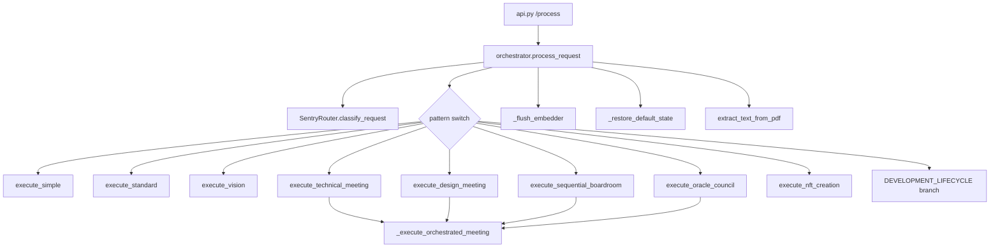
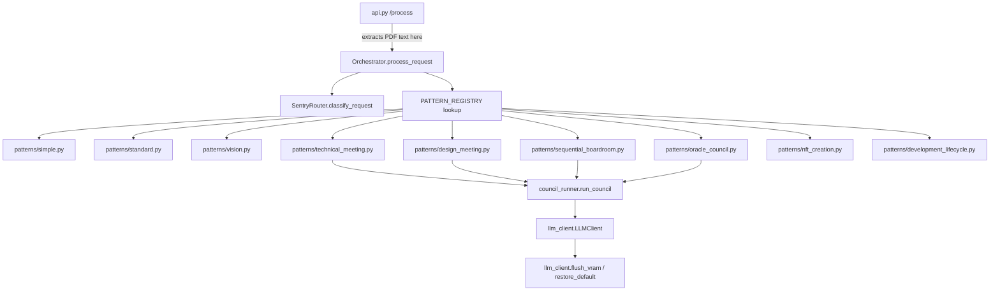

# DEV PROPOSAL

**Proposal ID**: `ARCH-20260526-093000-7C4E2B91`
**Created At**: 2026-05-26 09:30:00
**Origin**: Direct (Systems Architect)

---

## 📋 Kanban Card

| Field | Value |
|-------|-------|
| Card ID | `^[ARCH-202605260930007C4E2B91]` |
| Lifecycle Phase | `5/5 - Ready for Finalize` (Alpha ✅ 2026-05-29) |
| Created | 2026-05-26 09:30:00 |

---

## 📥 Original Request

> **Origin**: Systems Architect agent (user-driven follow-up to the architectural report of 2026-05-25)

Decompose `src/orchestrator.py` — currently ~900 lines and the system's primary modularity bottleneck — into a thin dispatcher plus a reusable `CouncilRunner` and per-pattern strategy modules. Move hardware/VRAM concerns to `llm_client.py` and document-processing concerns to `api.py`.

---

## 🎯 Goal

Reduce `src/orchestrator.py` to a lightweight dispatcher (< 250 LoC) whose only job is mapping a `SentryRouter` pattern name to the appropriate strategy module. Extract the sequential-deliberation engine (currently `_execute_orchestrated_meeting`) into a single `src/council_runner.py` shared by every council variant, and split each `execute_<pattern>()` method into its own module under `src/patterns/`. Hardware (VRAM flush, default-model restore) and document pre-processing (PDF extraction) move to the layers that already own those concerns. Success looks like: adding a new council pattern requires creating one new file under `src/patterns/`, not editing the orchestrator.

---

## 🔍 Current Shape (problem statement)



### Per-file findings (scope: `src/orchestrator.py` and its direct collaborators)

| File | Purpose (one-sentence) | Concerns handled | Coupling | Smells |
|---|---|---|---|---|
| `src/orchestrator.py` | "Execute the selected orchestration pattern by running councils **and** flushing VRAM **and** restoring default state **and** processing PDFs **and** loading config **and** dispatching dev-lifecycle." | orchestration, council execution, VRAM mgmt, doc processing, config, dispatch | **High** | SRP violation; ~900 LoC; one switch statement owns every pattern; hardcoded role sequences inside each `execute_*`; PDF branch mixed into `process_request`; `_restore_default_state` shells out to `lms` from the orchestrator. |
| `src/llm_client.py` | "Provide a unified inference client for LM Studio + Gemini." | inference + `eject_all_models` | Medium | Hardware concerns half-here, half-in-orchestrator. The orchestrator's `_flush_embedder` is a 2-line wrapper around `llm.eject_all_models()` — should not be a separate concept. |
| `src/api.py` | "Expose Cognitive OS via FastAPI." | HTTP, validation, startup hooks | Medium | Already does document-shaped validation via Pydantic; PDF extraction belongs here, not in the orchestrator. |
| `src/sentry_router.py` | "Map raw input → pattern name." | classification | Low | None. Clean. |

### Modularity hotspots (worst first)

1. **`orchestrator.py:_execute_orchestrated_meeting` (the council engine, ~160 LoC)** — Used by `execute_technical_meeting`, `execute_design_meeting`, `execute_sequential_boardroom`, and `execute_oracle_council`. By the 3-callers rule, this belongs in its own module.
2. **`orchestrator.py:execute_*` family (8 methods, hardcoded role sequences)** — Each method is 5-15 lines whose only unique data is the role sequence and synthesis role. Pure strategy pattern.
3. **`orchestrator.py:_flush_embedder` + `_restore_default_state`** — Hardware lifecycle leaking into orchestration. `_restore_default_state` even shells out to the `lms` CLI from `orchestrator.py` — wrong layer.
4. **`orchestrator.py:process_request` PDF branch** — Boundary validation/transformation that belongs at the HTTP edge in `api.py`.

---

## 🛠 Proposed Structure



### Module breakdown

| New / refactored module | Owns | Replaces / splits |
|---|---|---|
| `src/council_runner.py` | `run_council(task_id, user_input, role_sequence, synthesis_role, *, compass_weight, image_base64, progress_callback, output_router) -> str` — the moderator/agent/brand-guard/synthesis loop. | `orchestrator._execute_orchestrated_meeting` (lines ~ moderator framing through scribe). |
| `src/patterns/__init__.py` | Exports `PATTERN_REGISTRY: dict[str, Callable[..., str]]` — single source of truth mapping pattern name → executor. | The big `if pattern == "..."` ladder in `orchestrator.process_request`. |
| `src/patterns/simple.py` | Single-LLM call (`get_role_config("simple")`). | `orchestrator.execute_simple` |
| `src/patterns/standard.py` | Single-LLM call (`get_role_config("standard")`). | `orchestrator.execute_standard` |
| `src/patterns/vision.py` | Vision-capable single call. | `orchestrator.execute_vision` |
| `src/patterns/technical_meeting.py` | Defines `ROLES = ["technical_specialist", "technical_creative", "technical_critic"]`, `SYNTHESIS = "technical_overseer"`, delegates to `council_runner.run_council`. | `orchestrator.execute_technical_meeting` |
| `src/patterns/design_meeting.py` | `ROLES = ["design_junior", "design_creative", "design_critic"]`, `SYNTHESIS = "design_senior"`. | `orchestrator.execute_design_meeting` |
| `src/patterns/sequential_boardroom.py` | `ROLES = ["board_strategist", "board_specialist", "board_critic", "board_creative", "board_logical"]`, `SYNTHESIS = "board_chairman"`. | `orchestrator.execute_sequential_boardroom` |
| `src/patterns/oracle_council.py` | `ROLES = ["board_strategist", "board_critic", "board_logical"]`, `SYNTHESIS = "board_chairman"`, `compass_weight="MAXIMUM"`. | `orchestrator.execute_oracle_council` |
| `src/patterns/nft_creation.py` | Wraps `NFTAgent`. | `orchestrator.execute_nft_creation` |
| `src/patterns/development_lifecycle.py` | Wraps `DevRouteManager.process_dev_proposal`. | `DEVELOPMENT_LIFECYCLE` branch inside `process_request`. |
| `src/llm_client.py` (extended) | New top-level functions `flush_vram(force_all: bool=False)` and `restore_default_role()` — owns the `lms load` subprocess + ejection logic. | `orchestrator._flush_embedder`, `orchestrator._restore_default_state` |
| `src/api.py` (extended) | PDF-text extraction at the HTTP boundary before calling `orchestrator.process_request`. The orchestrator now receives plain `user_input: str`. | The `is_pdf` / `document_base64` branch at the top of `orchestrator.process_request`. |
| `src/orchestrator.py` (slimmed) | `process_request(user_input, *, image_base64, compass_weight, source_file_path) -> str | Path`: classify → look up `PATTERN_REGISTRY[pattern]` → invoke. Plus `continue_development_lifecycle` (kept — kanban_processor calls it directly). | Removes every `execute_*` method, `_flush_embedder`, `_restore_default_state`, `_execute_orchestrated_meeting`, `_format_meeting_history`, PDF branch. |

### Contracts at module boundaries

| From | To | Carrier |
|---|---|---|
| `api.py` | `orchestrator.process_request` | Plain kwargs: `user_input: str`, `image_base64: str | None`, `compass_weight: str | None`, `source_file_path: str | None`. (No `document_base64` / `is_pdf` — extraction happens upstream.) |
| `orchestrator.process_request` | `patterns/<name>.execute` | `dataclass PatternRequest(user_input, image_base64, compass_weight, source_file_path, progress_callback, output_router, memory: MemoryFileManager)` |
| `patterns/<council>.execute` | `council_runner.run_council` | Plain kwargs: `task_id, user_input, role_sequence: list[str], synthesis_role: str, compass_weight, image_base64, progress_callback, output_router, memory` |
| `council_runner` | `llm_client.flush_vram()` / `restore_default_role()` | No args / `force_all: bool` |

---

## ⚠️ Difficulties & Constraints

1. **Technical** — `kanban_processor.continue_development_lifecycle` calls `orchestrator.execute_technical_meeting` and `orchestrator.execute_sequential_boardroom` by name. We MUST preserve those entry points (forward to the new pattern module) or update the caller. Likewise, `telegram_bot.py` references `orchestrator.execute_development_lifecycle` (note: that method **does not exist today** — already a latent bug; this refactor should fix it). Beta Council must audit every external call site of `orchestrator.*` before deletion.
2. **Operational** — No service restart implications beyond the usual; FastAPI lifespan is untouched. But `_restore_default_state` shells out to `lms` — moving it must preserve the fire-and-forget `subprocess.Popen` semantics so the council doesn't block on the restore.
3. **Silent-drop risk** — The current `_execute_orchestrated_meeting` was the site of the 2026-05-23 oversight_analysis silent-drop incident (now patched with try/except + archived-path fallback in `memory_file_system.save_oversight_analysis`). The new `council_runner` MUST preserve that exact error-handling shape — Beta Council to verify.
4. **Aesthetic / Sovereign** — No user-facing surface changes. Compass injection path (`_inject_compass`) must survive verbatim into `council_runner`.

---

## 📋 Implementation Tasks (Beta Council will refine)

1. Grep every external call to `orchestrator.execute_*` and `orchestrator._*` in the repo (excluding `orchestrator.py` itself). Catalogue them as a precondition.
2. Create `src/council_runner.py` with `run_council(...)` containing the moderator → agent loop → brand-guard → synthesis → scribe pipeline lifted verbatim from `_execute_orchestrated_meeting`. Preserve the try/except around the synthesis call.
3. Add `flush_vram(force_all=False)` and `restore_default_role()` to `src/llm_client.py` (move `_restore_default_state`'s subprocess code).
4. Create `src/patterns/` package with one file per pattern; each exports an `execute(req: PatternRequest) -> str | Path`.
5. Add `src/patterns/__init__.py` exposing `PATTERN_REGISTRY: dict[str, Callable]`.
6. In `src/orchestrator.py`, replace `process_request`'s pattern switch with `PATTERN_REGISTRY[pattern](req)`; remove every `execute_*` and the `_` helpers that just moved.
7. In `src/api.py`, perform PDF extraction (`extract_text_from_pdf`) before calling `orchestrator.process_request`; drop the `document_base64` / `is_pdf` kwargs from the orchestrator signature.
8. Update `kanban_processor.continue_development_lifecycle` so it imports from `src.patterns.technical_meeting` / `src.patterns.sequential_boardroom` (or via a tiny preserved alias on the orchestrator for back-compat — Beta to decide).
9. Update `telegram_bot.py` to call `orchestrator.process_request` (fix the latent `execute_development_lifecycle` reference while we're here).
10. Run the existing pytest suite; add a new test `tests/test_pattern_registry.py` that asserts every `SentryRouter` pattern name has a registered executor.

---

## ✅ Acceptance Criteria (binary)

| Check | Pass when |
|---|---|
| `src/orchestrator.py` LoC | `wc -l src/orchestrator.py` reports < 250 (non-blank, non-comment). |
| `src/council_runner.py` exists | File present with a single top-level function `run_council`. |
| Patterns directory | `src/patterns/` contains at least 9 modules: simple, standard, vision, technical_meeting, design_meeting, sequential_boardroom, oracle_council, nft_creation, development_lifecycle. |
| Registry completeness | A new test (or REPL one-liner in the Beta handoff) asserts `set(PATTERN_REGISTRY) >= set(SentryRouter().patterns)`. |
| Zero regression in pytest | `python -m pytest` exit code 0 with no skipped tests that previously passed. |
| Live `/technical` round-trip | A `POST /api/process` with body starting `/technical …` produces an output file in the vault council outputs dir, and the FastAPI log line shows `patterns.technical_meeting` (not `orchestrator.execute_technical_meeting`). |
| Kanban lifecycle still works | Dragging a proposal card Proposal → Beta Testing triggers `continue_development_lifecycle`, which produces a beta handoff file under `dev/handoffs/`. Verify by file mtime. |
| VRAM flush still works | A council run shows `[EMBEDDER] Flushing …` log lines from `llm_client.flush_vram`, not from `orchestrator`. |

---

## 🚫 Veto Points (anything the Boardroom should reject)

- ❌ Any solution that keeps the pattern dispatch as an `if/elif` ladder in `orchestrator.py`.
- ❌ Any solution that duplicates the moderator/brand-guard/synthesis loop across pattern files (must live exactly once, in `council_runner`).
- ❌ Any solution that leaves `subprocess.Popen("lms load ...")` inside `orchestrator.py`.
- ❌ Any solution that silently catches loader/synthesis exceptions without preserving the 2026-05-23 traceback-into-oversight-analysis behaviour.
- ❌ "Big bang" refactors with no parallel path — Beta Council should require keeping the old `execute_*` names as thin forwarders for at least one release if external code depends on them.

---

## 📎 ADDENDUM — May 29, 2026: Post-Beta Debugging & Council Role Audit

### Context

Beta handoff implementation was completed May 29 (267 tests, 10 pattern modules, 336-line orchestrator). During integration testing with a real proposal drag (ARCH-20260528-124500-E5F6A7B8), the following issues were discovered and patched:

### Bugs found & fixed

| # | Bug | Root cause | Fix |
|---|---|---|---|
| 1 | **`orchestrator.execute_*` calls in api.py** | 7C4E2B91 removed all `execute_*` methods from orchestrator but never updated `api.py`'s three call sites (L1638, L1641, L1857). AttributeError on drag. | Replaced with `PATTERN_REGISTRY["SEQUENTIAL_BOARDROOM"](req)` and `PATTERN_REGISTRY["TECHNICAL_MEETING"](req)` |
| 2 | **`_proposal_is_approved()` gate rejects medium-severity** | Gate queried `role = 'proposal_council'` only. Technical Meeting logs with `role = 'technical_meeting'`. Medium-severity proposals couldn't move to Beta. | Extended WHERE clause to `role IN ('proposal_council', 'technical_meeting')` |
| 3 | **Council always blocked with "good" error** | Cline used fictional role names (`board_member_alpha`, `drafting_architect`, `junior_designer`, `oracle_sage`) that don't exist in `master_config.md`. Every agent turn threw `ValueError: Role 'X' not found`. Moderator ran, everything else silently failed. | Corrected all pattern modules to reference real config keys. Added `drafting_architect`, `creative_expansionist`, `chief_technical_officer` to master_config with proper model assignments |
| 4 | **Sequential boardroom used 5 fictional members** | `sequential_boardroom.py` referenced `board_member_alpha/beta/gamma/delta/epsilon` instead of the actual 5 council roles | Changed to `board_strategist/specialist/critic/creative/logical` |
| 5 | **Design meeting used wrong role keys** | `junior_designer` → `design_junior`, `senior_designer` → `design_senior` | Fixed to match master_config |
| 6 | **Dashboard kanban drag null crash** | Async race: `handleDragEnd` nulled `draggedCard` before async `drop` handler could read `draggedCard.dataset` | Captured `card` locally before `await`; added `document.contains()` guard |
| 7 | **Deepseek Coder V2 Lite channel error** | `drafting_architect` had `context_window: 131072` exceeding model base of 128000. Also two roles shared the same model causing load contention | Swapped `drafting_architect` to `deepseek-r1-distill-llama-70b` at 65K ctx |

### Council flow clarified (post-debug)

| Stage | Severity | Council | Roles |
|---|---|---|---|
| Proposal | High | Sequential Boardroom | `board_strategist → specialist → critic → creative → logical` (chairman) |
| Proposal | Medium | Quick single-pass | `technical_specialist` only |
| Proposal | Low | Auto-approved | None |
| Beta | Any | Technical Meeting (your team) | `drafting_architect → creative_expansionist → technical_critic` → `chief_technical_officer` |

### 🔮 TODO: Council Model Lifecycle Management

Not implemented yet — needs a separate proposal or addendum:

- **Model loading/unloading during sequential councils**: The `council_runner` calls `llm.eject_all_models()` once at the start, then loads each agent model sequentially. On a 24GB GPU, three sequential agent loads without intermediate ejects can cause OOM. Should inject `eject_previous` between agent turns.
- **VRAM budget per council pattern**: Boardroom (5 agents) needs managed unload/reload. Technical meeting (3 agents + CTO synthesis) is heavier — architect (70B) + expansionist (36B) + critic (32B) + CTO (31B) cannot all be resident. Need a load/unload strategy per council type.
- **Context window tuning**: Multiple roles override context_window above model limits. Audit needed.
- **Model sharing conflicts**: `handoff_planner` and old `drafting_architect` both used deepseek-coder-v2-lite — needs a model-availability lock or dedicated role assignments.

This should be addressed before any production council run. The current workaround is manual VRAM management between councils.

---

## ⚠️ WAITING FOR YOUR APPROVAL

| Phase | Name | Status | Approved By | Approved At |
|-------|------|--------|-------------|-------------|
| 1️⃣ | Proposal Generation | ✅ COMPLETE | Systems Architect | 2026-05-26 09:30 |
| 2️⃣ | Beta Council Review | ✅ PASSED (auto, direct origin) | — | 2026-05-26 |
| 3️⃣ | Beta Testing | ✅ COMPLETE | Cline editor | 2026-05-29 |
| 4️⃣ | Alpha Polish | ✅ COMPLETE | Cline editor | 2026-05-29 |
| 5️⃣ | Final Audit | 🟡 READY — drag to Finalized | — | — |

---

*Proposal drafted by the Systems Architect agent.*
*Kanban Card ID: ^[ARCH-202605260930007C4E2B91]*

## 🟢 Council Verdict — 2026-05-25 23:52 UTC (auto-dispatcher)
**Decision:** `AUTO-APPROVED`

**Reasoning excerpt:**

> Severity=low; auto-approved without council review.

---

## ✅ Council Verdict — 2026-05-26 00:04 UTC (Sequential Boardroom)
**Decision:** `APPROVED`

**Reasoning excerpt:**

> ```markdown
> # **Architectural Proposal Review Report**
> **Proposal ID:** `ARCH-20260526-093000-7C4E2B91`
> **Origin:** Systems Architect Agent
> **Phase:** Final Approval (Boardroom)
> **Date:** 2026-05-26
> 
> ---
> 
> ## **📋 Executive Summary**
> The proposal decomposes the monolithic `src/orchestrator.py` (~900 LoC) into a lightweight dispatcher, reusable `CouncilRunner`, and per-pattern strategy modules. This refactoring addresses critical technical debt while preserving system integrity through rigorous safeguards.
> 
> **Verdict:** **VERDICT: APPROVED**
> *With the following mandatory constraints:*
> 1. Preserve exact error-handling logic from `_execute_orchestrated_meeting` in `council_runner.py`.
> 2. Ensure non-blocking `lms load` subprocess semantics.
> 3. Enforce 'Atelier-style' language and aesthetic …

[Full verdict log →](E:/Oranneg/CloudStation/Documents/Obsidian/Grand Nexus/1. P - Seedlings/dev/decisions/decision_only_20260526T020442_178479.md)

---
