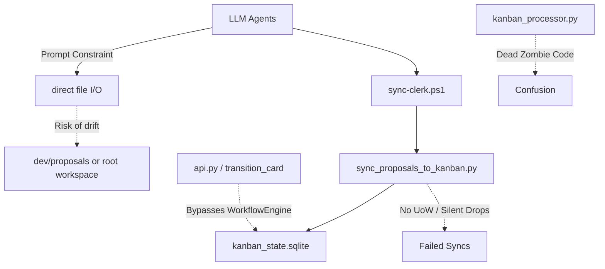
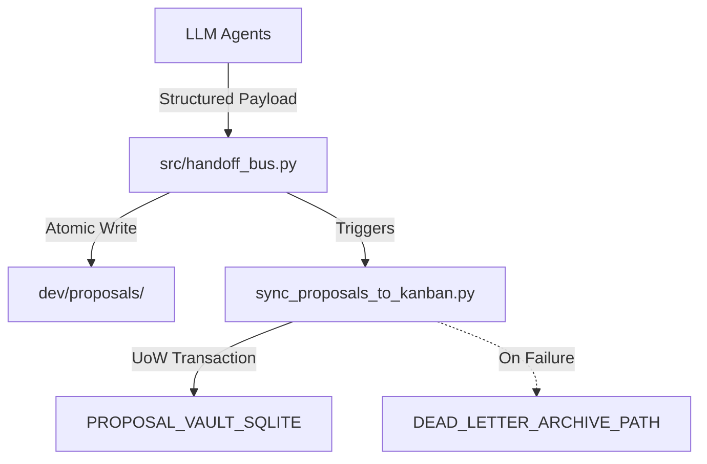

# ARCH PROPOSAL: Handoff Bus & Pipeline Hardening

**Proposal ID**: `ARCH-20260528-130000-622DF013`  
**Created At**: 2026-05-28 13:00:00  
**Origin**: Systems-Architect

> **ID-Prefix legend**  
> • `DEV-…` — generic dev proposal (Telegram, Obsidian, default flow)  
> • `ARCH-…` — Systems Architect agent output  
> • `NLST-…` — analyst agents (Data Flow Tracer, System Analyst, Bench Runner)

---

## 📋 Kanban Card

| Field | Value |
|-------|-------|
| Card ID | `ARCH-20260528130000622DF013` |
| Lifecycle Phase | `1/5 - Proposal` |
| Substatus | `high_severity` |
| Created | 2026-05-28 13:00:00 |
| Updated | 2026-06-01 00:00:00 |

> **To move to next phase**: Drag card in Kanban Board to the right column.

---

## ⚠️ WAITING FOR YOUR APPROVAL

> **⚠️ THIS PROPOSAL REQUIRES YOUR APPROVAL TO PROCEED**

| Phase | Name | Status | Approved By | Approved At |
|-------|------|--------|-------------|-------------|
| 1️⃣ | Proposal Generation | ⏳ Awaiting Approval | - | - |
| 2️⃣ | Beta Council Review | 🔒 Locked | - | - |
| 3️⃣ | Beta Testing | 🔒 Locked | - | - |
| 4️⃣ | Alpha Polish (GUI+Perf) | 🔒 Locked | - | - |
| 5️⃣ | Final Audit | 🔒 Locked | - | - |

---

## Original Request

Formalize the structural hardening mandated by `E:\Oranneg\CloudStation\Documents\Obsidian\Grand Nexus\1. P - Seedlings\dev\decisions\decision_only_20260528T114023_400376.md` and the audit report `E:\Antigravity\mock_vault\agent_reports\Pipeline_Audit_Report.md`.
Replace fragile prompt-based agent constraints with a hardcoded `handoff_bus.py`, introduce transactional safety and dead-letter routing to Kanban sync, and align variables with the Dark Maestro aesthetic.

**Update June 1, 2026:** End the cycle of agents applying quick-fixes that bypass central governance. Address severe architectural drift where the API layer (`api.py`) bypasses the `WorkflowEngine` with hardcoded gate checks. Reroute all transitions through the Workflow Engine and excise zombie code (`kanban_processor.py`).

---

## 🎯 Goal

Transition agent output boundaries from "soft" narrative constraints to "hard" API contracts. By routing all agent saves through a new `handoff_bus.py` and wrapping the Kanban sync in Unit of Work (UoW) logic with dead-letter routing, we eliminate silent drops and LLM drift. Additionally, we enforce the Dark Maestro sovereign aesthetic across pipeline variable names.

**Update June 1, 2026:** Restore architectural integrity by stripping hardcoded Kanban gate checks out of `api.py` and forcing all phase transitions through `workflow_engine.transition()`. Delete the deprecated `kanban_processor.py` watcher to prevent agents from attempting to fix dead code, and update the system architecture document to reflect reality. Additionally, introduce an automated, chronologically-aware sync for `SYSTEM_ARCHITECTURE.md` when `ARCH-` proposals reach the `deployed` phase.

---

## 🔍 Current Shape (problem statement)

Prompt-based agent constraints are fragile and vulnerable to LLM drift. To guarantee zero silent drops, we must transition from "soft" narrative rules to a "hard" API contract via a new `handoff_bus.py` module. Furthermore, the Kanban sync utility requires Unit of Work (UoW) transaction wrappers and dead-letter routing to safely handle database locking or drift scenarios.



---

## 🛠 Proposed Structure



### Module breakdown

| New / refactored module | Owns | Replaces / splits |
|---|---|---|
| `src/handoff_bus.py` | Exclusive write API for agents; payload validation before file I/O | Direct agent `read_file`/`write_file` paths |
| `src/sync_proposals_to_kanban.py` | Idempotent SQLite upserts with UoW and dead-letter routing | Current unguarded script |
| `src/paths.py` | Aesthetic variable renaming (`DEAD_LETTER_ARCHIVE_PATH`, `PROPOSAL_VAULT_SQLITE`) | Current generic path variables |

### Contracts at module boundaries

| From | To | Carrier (dataclass / pydantic model / dict shape) |
|---|---|---|
| Agents | `handoff_bus` | JSON / Pydantic: `{ "title": str, "content": str, "metadata": dict }` |
| `handoff_bus` | `sync_proposals_to_kanban` | CLI invocation with explicit paths |
| `sync_proposals_to_kanban` | `kanban_state.sqlite` | SQLite UoW transaction boundary |

---

## ⚠️ Difficulties & Constraints

1. **Technical**: Breaking changes to all agent system prompts (they must now call `handoff_bus` or output specific JSON instead of raw markdown).
2. **Operational**: Requires cross-directory stress testing (`pytest`) to verify the pathing bounds.
3. **Aesthetic / Sovereign**: Every pipeline log must be audited to ensure the Dark Maestro aesthetic is maintained.

---

## 📋 Implementation Tasks

1. Create `src/handoff_bus.py` with Pydantic validation for incoming proposal payloads.
2. Refactor `src/sync_proposals_to_kanban.py` to use a context manager for transactions and route failures to `DEAD_LETTER_ARCHIVE_PATH`.
3. Rename variables in `src/paths.py` and `src/output_router.py` to match the gothic aesthetic.
4. Add `pytest` mock shifts to verify `handoff_bus.py` rejects CWD changes.
5. Update `@Proposal Clerk` and other agent instructions to strictly use `handoff_bus.py` for submission.
6. **(June 1) API Governance:** Refactor `api.py:1896-1950` (`transition_card`), removing all manual gate checks (like `BETA_HANDOFF.md`) and replacing with `await get_workflow_engine().transition(req)`.
7. **(June 1) Zombie Code Purge:** Delete `src/kanban_processor.py` entirely and remove/refactor any integration tests that depend on it.
8. **(June 1) Docs Update:** Remove `KANBAN_PROC` from diagrams in `docs/SYSTEM_ARCHITECTURE.md` and document `workflow_router.py`.
9. **(June 1) Automated Architecture Sync:** Implement a post-commit hook in `api.py` (via `background_tasks`) that triggers when an `ARCH-` proposal enters the `deployed` column. This hook will auto-update `SYSTEM_ARCHITECTURE.md`. It MUST include a chronological guard (e.g., checking proposal timestamps or IDs) to prevent older, delayed `finalized` → `deployed` transitions from overwriting architecture states established by newer proposals.

---

## 📎 ADDENDUM — May 29, 2026: Dashboard Kanban Drag Race Condition

### Context

During testing of the Kanban column drag-and-drop in `dashboard/script.js`, a race condition was discovered in the `drop` event handler. Three separate null-reference bugs were found and patched:

### Bugs identified

| Bug | Location | Root cause | Fix |
|---|---|---|---|
| **Null `this` in `handleDragEnd`** | `script.js` L2463 | `this` reference goes stale after card removed from DOM during rerender | Use captured global `draggedCard` instead of `this` |
| **Stale `draggedCard` in async drop** | `script.js` L2490 | `handleDragEnd` fires synchronously after `drop`, nulling `draggedCard` before the async `drop` handler can read `draggedCard.dataset` | Capture `card` locally before `await`; replace all `draggedCard` refs with `card` |
| **`classList` on detached card** | `script.js` L2535 | `loadBoard()` removes the card from DOM; error handler tries `card.classList.remove('is-loading')` on a detached node | Guard with `document.contains(card)` before mutating |

### Relevance to this proposal

This proposal's `handoff_bus.py` + UoW + dead-letter routing would have made the backend side of drop failures visible (currently they're silent — the POST to `/api/workflow/transition` fails and the only evidence is a browser console error). The frontend JS fixes above address the DOM-level bugs, but the **backend equivalent** — a Kanban transition POST that fails because the proposal isn't in the SQLite store or the workflow engine rejects it — still has no dead-letter visibility. Section 2 of this proposal ("Refactor sync_proposals_to_kanban.py... route failures to DEAD_LETTER_ARCHIVE_PATH") directly addresses this gap.

### Merge priority

The three JS fixes should land immediately (they're already applied to `dashboard/script.js`). The backend dead-letter routing (this proposal's Section 2) should be prioritized alongside the E5F6A7B8 audit gates, since both deal with transition failure visibility.

---

## ✅ Acceptance Criteria (binary)

| Check | Pass when |
|---|---|
| Handoff Bus | `src/handoff_bus.py` exists and raises an exception if a payload lacks required metadata. |
| Transactional Sync | Failing a sync manually in `sync_proposals_to_kanban.py` drops a log file into `DEAD_LETTER_ARCHIVE_PATH`. |
| Zero Leakage | Running `pytest tests/` in the workspace root passes with no files created in `E:\Antigravity`. |
| Aesthetic Audit | `grep -rn "dead_letter_dir"` returns 0 hits in `src/`. |
| API Cleanliness | `grep -rn "req.target_column == 'alpha polish'" src/api.py` returns 0 hits (all checks delegated to Workflow Engine). |
| Zombie Code Removed | `src/kanban_processor.py` no longer exists on disk. |
| Automated Docs Sync | Moving an older `ARCH-` proposal to `deployed` skips the docs update if a newer `ARCH-` proposal is already deployed, preventing regressions. |

---

## 🚫 Veto Points (anything the Boardroom should reject)

- ❌ Relying on agent prompts to enforce save paths instead of `handoff_bus.py`.
- ❌ Unguarded Kanban database writes without a dead-letter fallback for tracking drops.
- ❌ Generic, non-sovereign naming conventions for pipeline logs and folders.

## ✅ Council Verdict — 2026-05-28 11:51 UTC (Technical Meeting)
**Decision:** `APPROVED`

**Reasoning excerpt:**

> ```markdown
> # **ARCH-20260528-130000-622DF013: Proposal Review & Verdict**
> **Proposal Title:** Handoff Bus & Pipeline Hardening
> **Origin:** Systems Architect
> **Severity:** Medium
> 
> ---
> 
> ## **📋 Executive Summary**
> 
> The proposal introduces a structural hardening of the agent pipeline by replacing fragile prompt-based constraints with a robust, hardcoded `handoff_bus.py` system. This transition aims to eliminate LLM drift and silent drops through:
> - **Strict API contracts** (Pydantic validation)
> - **Transactional safety** (Unit of Work for Kanban sync)
> - **Dead-letter routing** (for failed operations)
> - **Dark Maestro aesthetic enforcement** (sovereign naming conventions)
> 
> The proposal is **VERDICT: APPROVED**, but with critical refinements to ensure technical robustness and brand …

[Full verdict log →](E:/Oranneg/CloudStation/Documents/Obsidian/Grand Nexus/1. P - Seedlings/dev/decisions/decision_only_20260528T135140_575006.md)

---

## 📎 ADDENDUM — May 31, 2026: Dual-Vault Implementation Pipeline Failures

### Context

During implementation of the dual-vault architecture (DEV-20260530-150000-D5E6F7A8), **9 critical pipeline failures** were discovered that demonstrate exactly why this proposal's hardening work is essential. These failures represent the "soft" constraints and missing transactional safety that this proposal aims to fix.

### Pipeline failures discovered

| # | Failure | Location | Root cause | Impact |
|---|---------|----------|------------|--------|
| **1** | **AttributeError: 'Orchestrator' object has no attribute 'execute_technical_meeting'** | `api.py` L1628, L1844 | Orchestrator refactored to use `PATTERN_REGISTRY` but api.py still called old methods | Council dispatcher crashed, no approval logged, Kanban transition blocked |
| **2** | **Approval gate always fails** | `api.py` L1730 (`_proposal_is_approved`) | `log_decision()` writes to `decisions` table but gate reads from `approval_log` table | Proposals can never transition to Beta Testing without manual DB intervention |
| **3** | **Migration status parser crash** | `migration_manager.py` L170 | `migration_status()` couldn't parse marker file format (expected `key:val` but got `Files copied: 5, skipped: 10`) | Migration status check crashes, preventing re-runs |
| **4** | **Shadowed path constant** | `proposal_sync.py` L42 | Re-derived `COS_VAULT_PROPOSALS_DIR` locally instead of importing from `paths.py` | Syncer could write to wrong vault if paths diverge |
| **5** | **Missing import** | `handoff_writer.py` L183, L390 | Used `COS_VAULT_TEMPLATES_DIR` but never imported it | Runtime ImportError when generating handoffs |
| **6** | **Missing boot calls** | `api.py` L188 (lifespan) | Didn't call `_ensure_cos_vault_structure()` or `migrate_to_cos_vault()` | COS vault directories never created, migration never runs |
| **7** | **Wrong pattern names** | `obsidian_writer.py` L20 | `pattern_to_council_type()` checked for `ORACLE_MEETING` but actual pattern is `ORACLE_COUNCIL` | System-side councils routed to wrong vault |
| **8** | **Memory logs not dual-vault routed** | `obsidian_writer.py` L59 | Always used `VAULT_MEMORY_LOGS` (Grand Nexus) even for system-side councils | Memory logs pollute user vault |
| **9** | **Schema validator rejects vault buckets** | `routing_rules_schema.py` L33 | `ALLOWED_DESTINATIONS` didn't include `proposals_vault`, `handoffs_vault`, etc. | Output router can't route to COS vault destinations |

### Relevance to this proposal

These failures are **textbook examples** of why this proposal's hardening work is critical:

1. **Fragile method contracts** (Failure #1): The Orchestrator refactor broke api.py because there was no API contract enforcement. `handoff_bus.py` with Pydantic validation would have caught this at import time.

2. **Dual-write without transactional safety** (Failure #2): `log_decision()` wrote to one table but the gate read from another — a classic "split-brain" bug. UoW transaction boundaries would have ensured atomic writes to both tables.

3. **Silent configuration drift** (Failures #4, #7): Path constants were re-derived or pattern names were wrong, causing silent routing to wrong vaults. Dead-letter routing would have made these visible immediately.

4. **Missing fail-fast validation** (Failures #5, #6, #9): Imports were missing, boot calls were absent, schema didn't include new buckets. Pydantic validation at module boundaries would have raised on startup.

5. **Parser fragility** (Failure #3): The migration status parser crashed on unexpected format. Structured payloads with explicit schemas would prevent this.

### Recommended additions to implementation tasks

Add these tasks to Section "Implementation Tasks":

6. **Add dual-write transaction wrapper** to `approval_logger.py` that atomically writes to both `decisions` and `approval_log` tables, with rollback on failure.

7. **Add startup validation** to `api.py` lifespan that verifies all required path constants are imported and all boot functions are callable.

8. **Add schema migration** to `routing_rules_schema.py` that auto-discovers new destination buckets from `output_router.py` path_map.

9. **Add pattern name validation** to `obsidian_writer.py` that cross-references `sentry_router.py` PATTERN_REGISTRY keys.

10. **Add dead-letter routing** for council dispatcher failures — when `PATTERN_REGISTRY[pattern]` raises, route the failure to `DEAD_LETTER_ARCHIVE_PATH` with full context.

### Merge priority

These 10 tasks should be **merged into the main implementation plan** before Beta Testing begins. The dual-vault implementation (DEV-20260530-150000-D5E6F7A8) is currently in Beta Testing with manual workarounds for failures #1-#9, but those workarounds are fragile and will break on the next refactor.

---
