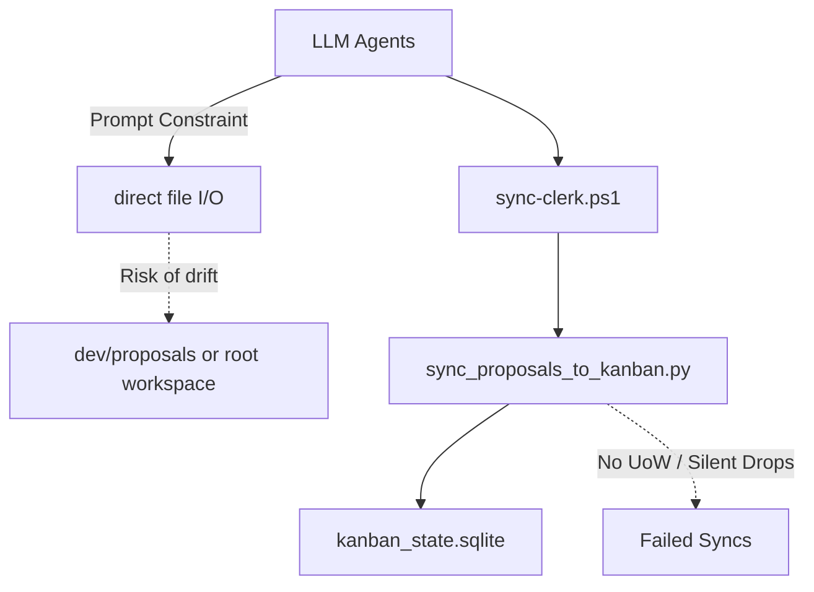
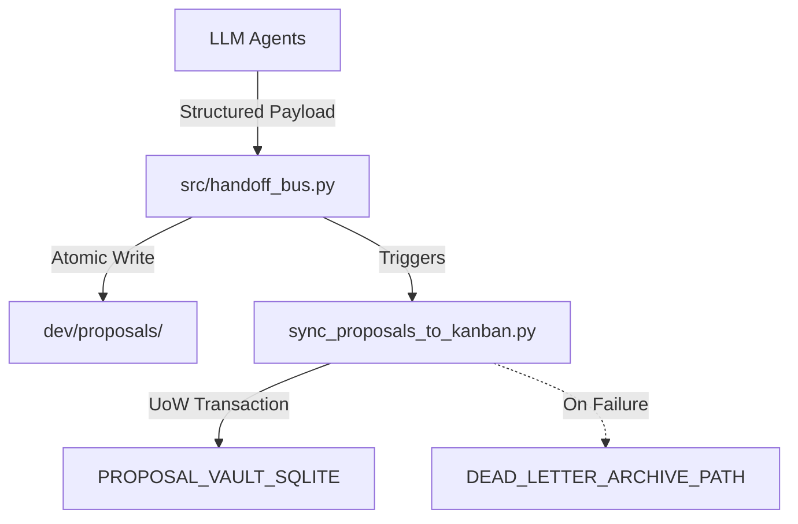

# ARCH PROPOSAL: Handoff Bus & Pipeline Hardening

**Proposal ID**: `ARCH-20260528-130000-622DF013`  
**Created At**: 2026-05-28 13:00:00  
**Origin**: Systems-Architect

> **ID-Prefix legend**  
> • `DEV-…` — generic dev proposal (Telegram, Obsidian, default flow)  
> • `ARCH-…` — Systems Architect agent output  
> • `NLST-…` — analyst agents (Data Flow Tracer, System Analyst, Bench Runner)

---

## 📋 Kanban Card

| Field | Value |
|-------|-------|
| Card ID | `ARCH-20260528130000622DF013` |
| Lifecycle Phase | `1/5 - Proposal` |
| Created | 2026-05-28 13:00:00 |
| Updated | - |

> **To move to next phase**: Drag card in Kanban Board to the right column.

---

## ⚠️ WAITING FOR YOUR APPROVAL

> **⚠️ THIS PROPOSAL REQUIRES YOUR APPROVAL TO PROCEED**

| Phase | Name | Status | Approved By | Approved At |
|-------|------|--------|-------------|-------------|
| 1️⃣ | Proposal Generation | ⏳ Awaiting Approval | - | - |
| 2️⃣ | Beta Council Review | 🔒 Locked | - | - |
| 3️⃣ | Beta Testing | 🔒 Locked | - | - |
| 4️⃣ | Alpha Polish (GUI+Perf) | 🔒 Locked | - | - |
| 5️⃣ | Final Audit | 🔒 Locked | - | - |

---

## Original Request

Formalize the structural hardening mandated by `E:\Oranneg\CloudStation\Documents\Obsidian\Grand Nexus\1. P - Seedlings\dev\decisions\decision_only_20260528T114023_400376.md` and the audit report `E:\Antigravity\mock_vault\agent_reports\Pipeline_Audit_Report.md`.
Replace fragile prompt-based agent constraints with a hardcoded `handoff_bus.py`, introduce transactional safety and dead-letter routing to Kanban sync, and align variables with the Dark Maestro aesthetic.

---

## 🎯 Goal

Transition agent output boundaries from "soft" narrative constraints to "hard" API contracts. By routing all agent saves through a new `handoff_bus.py` and wrapping the Kanban sync in Unit of Work (UoW) logic with dead-letter routing, we eliminate silent drops and LLM drift. Additionally, we enforce the Dark Maestro sovereign aesthetic across pipeline variable names.

---

## 🔍 Current Shape (problem statement)

Prompt-based agent constraints are fragile and vulnerable to LLM drift. To guarantee zero silent drops, we must transition from "soft" narrative rules to a "hard" API contract via a new `handoff_bus.py` module. Furthermore, the Kanban sync utility requires Unit of Work (UoW) transaction wrappers and dead-letter routing to safely handle database locking or drift scenarios.



---

## 🛠 Proposed Structure



### Module breakdown

| New / refactored module | Owns | Replaces / splits |
|---|---|---|
| `src/handoff_bus.py` | Exclusive write API for agents; payload validation before file I/O | Direct agent `read_file`/`write_file` paths |
| `src/sync_proposals_to_kanban.py` | Idempotent SQLite upserts with UoW and dead-letter routing | Current unguarded script |
| `src/paths.py` | Aesthetic variable renaming (`DEAD_LETTER_ARCHIVE_PATH`, `PROPOSAL_VAULT_SQLITE`) | Current generic path variables |

### Contracts at module boundaries

| From | To | Carrier (dataclass / pydantic model / dict shape) |
|---|---|---|
| Agents | `handoff_bus` | JSON / Pydantic: `{ "title": str, "content": str, "metadata": dict }` |
| `handoff_bus` | `sync_proposals_to_kanban` | CLI invocation with explicit paths |
| `sync_proposals_to_kanban` | `kanban_state.sqlite` | SQLite UoW transaction boundary |

---

## ⚠️ Difficulties & Constraints

1. **Technical**: Breaking changes to all agent system prompts (they must now call `handoff_bus` or output specific JSON instead of raw markdown).
2. **Operational**: Requires cross-directory stress testing (`pytest`) to verify the pathing bounds.
3. **Aesthetic / Sovereign**: Every pipeline log must be audited to ensure the Dark Maestro aesthetic is maintained.

---

## 📋 Implementation Tasks

1. Create `src/handoff_bus.py` with Pydantic validation for incoming proposal payloads.
2. Refactor `src/sync_proposals_to_kanban.py` to use a context manager for transactions and route failures to `DEAD_LETTER_ARCHIVE_PATH`.
3. Rename variables in `src/paths.py` and `src/output_router.py` to match the gothic aesthetic.
4. Add `pytest` mock shifts to verify `handoff_bus.py` rejects CWD changes.
5. Update `@Proposal Clerk` and other agent instructions to strictly use `handoff_bus.py` for submission.

---

## 📎 ADDENDUM — May 29, 2026: Dashboard Kanban Drag Race Condition

### Context

During testing of the Kanban column drag-and-drop in `dashboard/script.js`, a race condition was discovered in the `drop` event handler. Three separate null-reference bugs were found and patched:

### Bugs identified

| Bug | Location | Root cause | Fix |
|---|---|---|---|
| **Null `this` in `handleDragEnd`** | `script.js` L2463 | `this` reference goes stale after card removed from DOM during rerender | Use captured global `draggedCard` instead of `this` |
| **Stale `draggedCard` in async drop** | `script.js` L2490 | `handleDragEnd` fires synchronously after `drop`, nulling `draggedCard` before the async `drop` handler can read `draggedCard.dataset` | Capture `card` locally before `await`; replace all `draggedCard` refs with `card` |
| **`classList` on detached card** | `script.js` L2535 | `loadBoard()` removes the card from DOM; error handler tries `card.classList.remove('is-loading')` on a detached node | Guard with `document.contains(card)` before mutating |

### Relevance to this proposal

This proposal's `handoff_bus.py` + UoW + dead-letter routing would have made the backend side of drop failures visible (currently they're silent — the POST to `/api/workflow/transition` fails and the only evidence is a browser console error). The frontend JS fixes above address the DOM-level bugs, but the **backend equivalent** — a Kanban transition POST that fails because the proposal isn't in the SQLite store or the workflow engine rejects it — still has no dead-letter visibility. Section 2 of this proposal ("Refactor sync_proposals_to_kanban.py... route failures to DEAD_LETTER_ARCHIVE_PATH") directly addresses this gap.

### Merge priority

The three JS fixes should land immediately (they're already applied to `dashboard/script.js`). The backend dead-letter routing (this proposal's Section 2) should be prioritized alongside the E5F6A7B8 audit gates, since both deal with transition failure visibility.

---

## ✅ Acceptance Criteria (binary)

| Check | Pass when |
|---|---|
| Handoff Bus | `src/handoff_bus.py` exists and raises an exception if a payload lacks required metadata. |
| Transactional Sync | Failing a sync manually in `sync_proposals_to_kanban.py` drops a log file into `DEAD_LETTER_ARCHIVE_PATH`. |
| Zero Leakage | Running `pytest tests/` in the workspace root passes with no files created in `E:\Antigravity`. |
| Aesthetic Audit | `grep -rn "dead_letter_dir"` returns 0 hits in `src/`. |

---

## 🚫 Veto Points (anything the Boardroom should reject)

- ❌ Relying on agent prompts to enforce save paths instead of `handoff_bus.py`.
- ❌ Unguarded Kanban database writes without a dead-letter fallback for tracking drops.
- ❌ Generic, non-sovereign naming conventions for pipeline logs and folders.

## ✅ Council Verdict — 2026-05-28 11:51 UTC (Technical Meeting)
**Decision:** `APPROVED`

**Reasoning excerpt:**

> ```markdown
> # **ARCH-20260528-130000-622DF013: Proposal Review & Verdict**
> **Proposal Title:** Handoff Bus & Pipeline Hardening
> **Origin:** Systems Architect
> **Severity:** Medium
> 
> ---
> 
> ## **📋 Executive Summary**
> 
> The proposal introduces a structural hardening of the agent pipeline by replacing fragile prompt-based constraints with a robust, hardcoded `handoff_bus.py` system. This transition aims to eliminate LLM drift and silent drops through:
> - **Strict API contracts** (Pydantic validation)
> - **Transactional safety** (Unit of Work for Kanban sync)
> - **Dead-letter routing** (for failed operations)
> - **Dark Maestro aesthetic enforcement** (sovereign naming conventions)
> 
> The proposal is **VERDICT: APPROVED**, but with critical refinements to ensure technical robustness and brand …

[Full verdict log →](E:/Oranneg/CloudStation/Documents/Obsidian/Grand Nexus/1. P - Seedlings/dev/decisions/decision_only_20260528T135140_575006.md)

---
