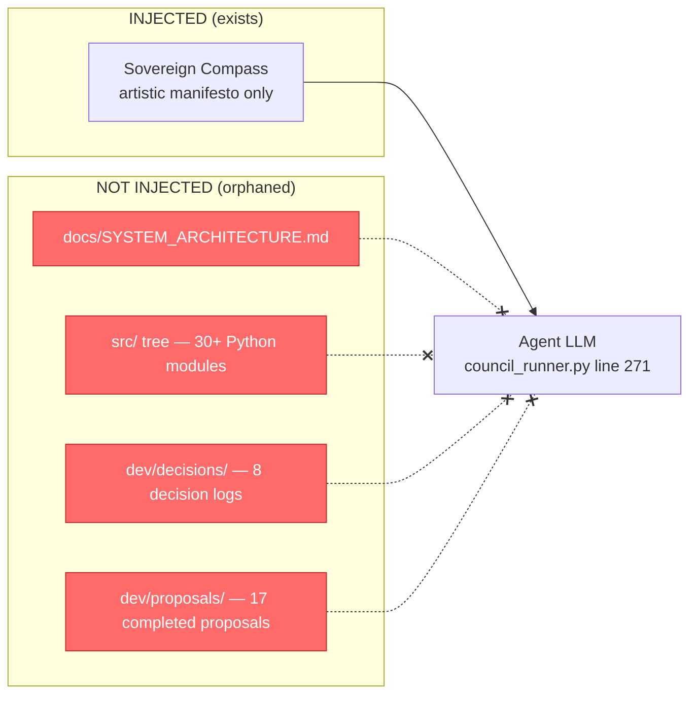
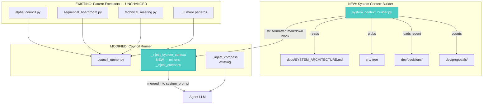

# ARCH PROPOSAL: System Context Injection for Council Agents

**Proposal ID**: `ARCH-20260529-150000-C7EBA3E9`
**Created At**: 2026-05-29 15:00:00
**Origin**: Systems-Architect

> **ID-Prefix legend**
> • `DEV-…` — generic dev proposal (Telegram, Obsidian, default flow)
> • `ARCH-…` — Systems Architect agent output
> • `NLST-…` — analyst agents (Data Flow Tracer, System Analyst, Bench Runner)

---

## 📋 Kanban Card

| Field | Value |
|-------|-------|
| Card ID | `^[ARCH-20260529150000C7EBA3E9]` |
| Lifecycle Phase | `4/5 - Alpha Polish` (Beta ✅ 2026-05-29, token measurement added to alpha) |
| Created | 2026-05-29 15:00:00 |
| Updated | - |

> **To move to next phase**: Drag card in Kanban Board to the right column.

---

## ⚠️ WAITING FOR YOUR APPROVAL

> **⚠️ THIS PROPOSAL REQUIRES YOUR APPROVAL TO PROCEED**

| Phase | Name | Status | Approved By | Approved At |
|-------|------|--------|-------------|-------------|
| 1️⃣ | Proposal Generation | ⏳ Awaiting Approval | - | - |
| 2️⃣ | Beta Council Review | 🔒 Locked | - | - |
| 3️⃣ | Beta Testing | 🔒 Locked | - | - |
| 4️⃣ | Alpha Polish (GUI+Perf) | 🔒 Locked | - | - |
| 5️⃣ | Final Audit | 🔒 Locked | - | - |

---

## 🔗 Depends On / Related To

| Proposal | Relationship | Status |
|----------|-------------|--------|
| `ARCH-20260526-093000-7C4E2B91` — Orchestrator Decomposition → `patterns/` | **Depends on** — This proposal modifies `council_runner.py`, the extraction that 7C4E2B91 created. The single-choke-point injection strategy only works because 7C4E2B91 already centralized all council execution through `run_council()`. | Alpha ✅ |
| `ARCH-20260528-124500-E5F6A7B8` — Alpha & Final Audit Pattern Modules + Strict Gates | **Related** — The quality of Alpha Council / Final Audit outputs drops when agents can't see the codebase they're auditing. This proposal directly improves the audit quality of E5F6A7B8's pattern executors. | Alpha 🟡 |
| `ARCH-20260522-205800-DA5B0A2D` — Dashboard SQLite Migration | **Related** — Dashboard files are a concrete example of codebase facts agents currently don't know about. | Backlog ⏳ |

---

## 📥 Original Request

> **Origin**: User (Beta Tester) → Systems Architect analysis, May 29, 2026.

**Discovery**: Council and boardroom agents — running through `run_council()` in `src/council_runner.py` — make architectural decisions in a near-vacuum. They receive persona prompts, the Sovereign Compass (artistic manifesto), the user's query, and same-session meeting history. They receive **zero** knowledge of the system they govern: no architecture document, no module listing, no past decisions, no completed proposals, no awareness of files that already exist. This "amnesia" degrades audit quality with every development phase — each new module increases the gap between what agents know and what exists.

**Concrete example (May 29, 2026)**: The `alpha_ux_specialist` evaluated `ARCH-20260528-124500-E5F6A7B8` (pattern module refactor) with no awareness that `dashboard/index.html`, `script.js`, and `styles.css` already exist, that the dashboard was refactored to v2.0.0 with a chat interface, or what past decisions were made about dashboard architecture.

**The gap is structural, affects all 11 council patterns, and grows monotonically.**

---

## 🎯 Goal

Create a new module `src/system_context_builder.py` that assembles a structured, auto-generated "System Knowledge" block from existing disk artifacts (architecture docs, module listings, recent decisions). Inject this block into every council agent's system prompt via `council_runner.py`, mirroring the existing `_inject_compass()` pattern.

**Success looks like**: An `alpha_ux_specialist` receiving a system prompt that includes *"Dashboard exists at `dashboard/index.html`, `script.js`, `styles.css`; refactored to v2.0.0 with chat interface; 17 completed proposals"* — and its audit referencing those facts.

---

## 🔍 Problem: Current Shape



### Root Cause

| File | Line | What's happening | Why it matters |
|------|------|-----------------|----------------|
| `src/council_runner.py` | 58-70 | `_inject_compass()` — **only** mechanism enriching agent system prompts | Injects only the Sovereign Compass (art manifesto); no analogue for system facts |
| `src/council_runner.py` | 252-270 | Builds `sequential_context` for agent prompts | Constructed entirely from `user_input` + `meeting_history`; zero external context |
| `src/memory_file_system.py` | 98 | `get_all_opinions()` only reads `active_path` | `get_task_data()` at line 104 searches archived but is never used for context injection |
| `docs/SYSTEM_ARCHITECTURE.md` | — | 120-line architecture doc with Mermaid diagrams | **Never read by any Python module** — orphaned |
| `dev/decisions/` | — | 8 decision logs with approval chains | **Never consulted by any agent** — orphaned |

---

## 🛠 Proposed Structure



### Module Breakdown

| New / Modified | Module | Owns | Lines |
|---------------|--------|------|-------|
| **NEW** | `src/system_context_builder.py` | Assembles structured `str`: architecture summary, module listing, last 3 decisions, proposal count | ~150 |
| **MODIFIED** | `src/council_runner.py` | Add `_inject_system_context()` at line ~70; call it alongside `_inject_compass()` at line 271 | +20 |
| **MODIFIED** | `src/patterns/__init__.py` | Add `system_context: Optional[str] = None` to `PatternRequest` (backward-compatible) | +1 |

### Key Design Decision — Single Choke Point

The injection point is `council_runner.py`'s `run_council()` — the **single choke point** through which all 11 patterns flow. This was made possible by **ARCH-20260526-093000-7C4E2B91** (orchestrator decomposition), which extracted `run_council()` as the unified council execution function. Zero changes needed to any pattern executor.

---

## 📋 Implementation Tasks

1. **Create `src/system_context_builder.py`** — `build_universal_context() -> str`:
   - Reads `docs/SYSTEM_ARCHITECTURE.md` (first 100 lines + Mermaid extraction)
   - Globs `src/**/*.py` for module listing
   - Loads 3 most recent `.md` files from `dev/decisions/` (title + first 3 lines each)
   - Counts `.md` files in `dev/proposals/`
   - Every I/O call wrapped in try/except returning `""`
   - Returns formatted markdown ≤ 1000 tokens

2. **Add `_inject_system_context()` to `council_runner.py`** — mirrors `_inject_compass()`. If builder raises, logs warning and returns `system_prompt` unchanged.

3. **Integrate into `run_council()`** — at line 271, merge: `system_prompt = _inject_system_context(_inject_compass(c, weight_override=compass_weight))`

4. **Add `system_context` field to `PatternRequest`** — reserves contract for Stage 2 query-specific enrichment.

5. **Verify** — Run alpha council on E5F6A7B8, confirm `alpha_ux_specialist` opinion mentions `dashboard/index.html`.

---

## ✅ Acceptance Criteria (binary)

| # | Check | Pass when |
|---|-------|-----------|
| 1 | New module importable | `python -c "from src.system_context_builder import build_universal_context; print(len(build_universal_context()))"` prints > 0 |
| 2 | Survives missing files | Delete `docs/SYSTEM_ARCHITECTURE.md`, run builder → returns partial block, no crash |
| 3 | Agents receive context | Run any council, inspect `council_memory/active/task_*.json` → system prompt contains "SYSTEM KNOWLEDGE" section |
| 4 | Context is fresh | Add file to `dev/decisions/`, run council again → new decision appears |
| 5 | No regressions | `pytest cognitive-os/tests/` passes with zero new failures |
| 6 | UX specialist knows about dashboard | Alpha council on E5F6A7B8 → opinion mentions `dashboard/index.html` or `dashboard/script.js` |
| 7 | Context window safe | Full council with ministral-3-3b (131k context) → no truncation errors |

---

## ⚠️ Constraints

1. **Context window pressure**: System knowledge block estimated 200-800 tokens. All council models have ≥131k context — well within bounds. Architecture doc truncated to first 100 lines if needed.

2. **Silent-drop prevention**: If builder crashes, council must still run. `try/except` in `_inject_system_context()` returns original `system_prompt` unchanged — never blocks deliberation.

3. **Auto-freshening**: Builder reads from disk on every `run_council()` call. Adding proposals/decisions takes effect in the next session immediately — no restart needed.

---

*Proposal drafted by the Systems Architect agent.*
*Kanban Card ID: ^[ARCH-20260529150000C7EBA3E9]*
## ✅ Council Verdict — 2026-05-29 19:50 UTC (Sequential Boardroom)
**Decision:** `APPROVED`

**Reasoning excerpt:**

> ```markdown
> # **Architectural Proposal Review Report**
> **Proposal ID**: ARCH-20260529-150000-C7EBA3E9
> **Origin**: Systems-Architect
> **Severity**: High
> **Phase**: Proposal Generation → Approved for Beta Council Review
> 
> ---
> 
> ## **📜 Executive Summary**
> The proposal introduces **System Context Injection**, a mechanism to enrich council agents' system prompts with structured knowledge of the codebase, architecture documents, and past decisions. This resolves the **"structural amnesia"**—where agents lack awareness of existing artifacts—thereby improving audit quality and decision-making coherence.
> 
> **Final Verdict**: **VERDICT: APPROVED**
> *With mandatory enhancements to eliminate silent degradation risks, enforce observability, and integrate poetic framing into the system context.*
> 
> ---
> 
> ## …

---
