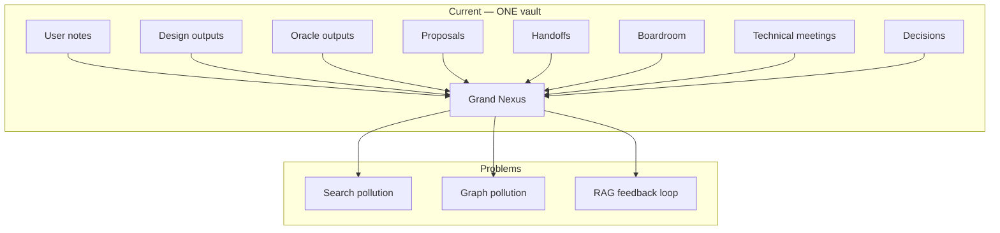
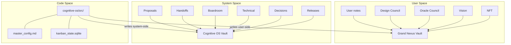

# DEV PROPOSAL

**Proposal ID**: `DEV-20260530-150000-D5E6F7A8`
**Created At**: 2026-05-30 15:00:00
**Origin**: Direct (Systems Architect)

---

## 📋 Kanban Card

| Field | Value |
|-------|-------|
| Card ID | `^[DEV-20260530150000D5E6F7A8]` |
| Lifecycle Phase | `1/5 - Proposal` |
| Created | 2026-05-30 15:00:00 |

---

## 📥 Original Request

> **Origin**: Systems Architect agent — user asked whether Cognitive OS and its agents should have their own vault separate from Grand Nexus, which is their personal thinking space.

Create a second Obsidian vault ("Cognitive OS" or user-named) to serve as the exclusive home for all system-side artifacts: proposals, handoffs, boardroom deliberations, technical meetings, decisions, releases, and kanban mirrors. Grand Nexus stays the user's clean personal space — only user-side council outputs (Design, Oracle, Vision, NFT) land there.

---

## 🎯 Goal

Today, every piece of the Cognitive OS writes into Grand Nexus — council reports in `AI-Help/cognitive-os/`, proposals and handoffs in `1. P - Seedlings/dev/`, decisions scattered across both. The user's personal searches return AI-generated council outputs alongside their own notes. The graph view is polluted with dev artifacts. The plugin's RAG semantic search picks up council outputs as "context" — a feedback loop.

The target: **two vaults with a hard contract at the boundary.**

Success looks like:
- Searching Grand Nexus returns only the user's notes + user-side council outputs
- Searching the COS vault returns only system artifacts
- `proposal_writer.py`, `handoff_writer.py`, and system-side `OutputRouter` destinations all point to the COS vault
- `obsidian_writer.py` (user-side councils) still writes to Grand Nexus
- The `OBSIDIAN_VAULT_PATH` env var controls Grand Nexus; a new `COS_VAULT_PATH` env var controls the COS vault
- Existing proposals/handoffs in Grand Nexus are migrated (not duplicated) on first boot

---

## 🔍 Current Shape (problem statement)

```
E:\Oranneg\...\Obsidian\Grand Nexus\    ← ONE vault for everything
│
├── User notes, daily notes, zettelkasten, projects...
│   ⚠ Mixed with AI-generated council outputs in search/graph
│
├── AI-Help\
│   └── cognitive-os\                   ← council outputs (ALL councils)
│       └── memory_logs\                ← deliberation JSON
│
├── 1. P - Seedlings\
│   └── dev\
│       ├── proposals\                  ← DEV-/ARCH- proposals
│       ├── handoffs\                   ← beta/alpha handoffs
│       ├── decisions\                  ← boardroom decisions
│       ├── releases\                   ← finalized releases
│       └── templates\                  ← handoff/proposal templates
│
└── (obsidian-lmstudio-agent plugin RAG searches this entire space)
    ⚠ Feedback loop: plugin suggests council outputs as "related notes"
```



### Per-file findings table

| File | Current behavior | Problem |
|---|---|---|
| `src/paths.py:54` | `VAULT_ROOT` = Grand Nexus (single vault constant) | No second vault concept exists |
| `src/paths.py:114-119` | `VAULT_COUNCIL_OUTPUTS` = `VAULT_ROOT / "AI-Help" / "cognitive-os"` | All councils dump into one folder; no distinction between user-side and system-side |
| `src/paths.py:93-110` | `VAULT_PROPOSALS_DIR`, `VAULT_HANDOFFS_DIR`, `VAULT_RELEASES_DIR`, `VAULT_DEV`, `DECISIONS_DIR` all under `VAULT_ROOT / "1. P - Seedlings" / "dev"` | System artifacts live in user's vault |
| `src/obsidian_writer.py:10` | `self.vault_path` defaults to `VAULT_COUNCIL_OUTPUTS` | Writer doesn't know which vault it's targeting; no council-type distinction |
| `src/handoff_writer.py:139` | `self.vault_handoffs_dir = str(VAULT_ROOT / "1. P - Seedlings" / "dev" / "handoffs")` | Hardcoded to Grand Nexus |
| `src/proposal_writer.py:46` | `self.vault_proposals_dir = str(VAULT_ROOT / "1. P - Seedlings" / "dev" / "proposals")` | Hardcoded to Grand Nexus |
| `src/proposal_sync.py:39` | `VAULT_PROPOSALS_DIR = VAULT_ROOT / "1. P - Seedlings" / "dev" / "proposals"` | Sync bridge mirrors to Grand Nexus |
| `src/output_router.py:58-77` | `resolve_destination_path()` maps to project paths only (PROPOSALS_DIR, DECISIONS_DIR, HANDOFFS_DIR) | No vault-side routing; system-side artifacts go to project dir, never to a system vault |
| `src/path_guard.py:14` | `"mock_vault/"` is in forbidden patterns | `mock_vault/` exists in workspace as a test fixture; could seed the COS vault |
| `obsidian-lmstudio-agent/src/settings.ts:53` | `cogOutputFolder: "/"` | Plugin writes Cognitive OS output to vault root; no second-vault awareness |

---

## 🛠 Proposed Structure

```
┌──────────────────────────────────────────────┐
│  Grand Nexus  (YOUR thinking space)          │
│                                              │
│  ✅ Your notes, zettelkasten, projects       │
│  ✅ User-side council outputs:               │
│     • Design Council                         │
│     • Oracle Council                         │
│     • Vision (image description)             │
│     • NFT creation                           │
│     → AI-Help/cognitive-os/                  │
│                                              │
│  ❌ NO proposals                             │
│  ❌ NO handoffs                              │
│  ❌ NO boardroom deliberations               │
│  ❌ NO technical meetings                    │
│  ❌ NO decisions                             │
│  ❌ NO releases                              │
│  ❌ NO kanban mirrors                        │
│                                              │
│  → Plugin RAG searches Grand Nexus only      │
│    (no feedback loop from OS artifacts)       │
└──────────────────────────────────────────────┘

┌──────────────────────────────────────────────┐
│  Cognitive OS Vault  (SYSTEM space)          │
│                                              │
│  ✅ All council outputs (full mirror)         │
│  ✅ Boardroom deliberations                  │
│  ✅ Technical meetings                       │
│  ✅ All proposals (DEV-, ARCH-, NLST-)       │
│  ✅ All handoffs (beta, alpha)               │
│  ✅ Final audits                             │
│  ✅ Decisions                                │
│  ✅ Releases                                 │
│  ✅ Kanban mirror files                      │
│  ✅ Templates                                │
│  ✅ Agent reports (DevLog)                   │
│  ✅ Memory logs                              │
│                                              │
│  → NOT searched by plugin RAG                │
│  → Dashboard loads from here for System tab  │
│  → Managed by the OS, browsed when debugging │
└──────────────────────────────────────────────┘

        ┌─────────────────────────────────┐
        │  cognitive-os/  (code, no vault)│
        │  dev/master_config.md           │
        │  dev/kanban_state.sqlite        │
        │  council_memory/                │
        │  logs/                          │
        └─────────────────────────────────┘
```



### Module breakdown

| New / refactored module | Owns | Changes from current |
|---|---|---|
| `src/paths.py` | Add `COS_VAULT_ROOT`, `COS_VAULT_PROPOSALS_DIR`, `COS_VAULT_HANDOFFS_DIR`, `COS_VAULT_DECISIONS_DIR`, `COS_VAULT_RELEASES_DIR`, `COS_VAULT_COUNCIL_OUTPUTS`, `COS_VAULT_MEMORY_LOGS` | Rename existing `VAULT_*` to `GN_VAULT_*` for clarity; keep `VAULT_ROOT` as alias for backward compat |
| `src/obsidian_writer.py` | Accept `vault_root: Path` parameter; `write_note()` routes to correct vault based on council type | Currently hardcodes `VAULT_COUNCIL_OUTPUTS` |
| `src/proposal_writer.py` | `self.vault_proposals_dir` → `COS_VAULT_PROPOSALS_DIR` | Currently `VAULT_ROOT / "1. P - Seedlings" / "dev" / "proposals"` |
| `src/handoff_writer.py` | `self.vault_handoffs_dir` → `COS_VAULT_HANDOFFS_DIR` | Currently `VAULT_ROOT / "1. P - Seedlings" / "dev" / "handoffs"` |
| `src/proposal_sync.py` | `VAULT_PROPOSALS_DIR` → `COS_VAULT_PROPOSALS_DIR` | Sync bridge syncs project dir ↔ COS vault, not Grand Nexus |
| `src/output_router.py` | `resolve_destination_path()` adds vault-side destinations for `proposals_vault`, `handoffs_vault`, `decisions_vault`, `releases_vault` | Currently only project-side destinations exist |
| `src/integration_flags.py` | Add `cos_vault_path` config flag | New flag controlling COS vault path |

### Contracts at module boundaries

| From | To | Carrier |
|---|---|---|
| `obsidian_writer.write_note()` | Grand Nexus `AI-Help/cognitive-os/` | User-side councils only (Design, Oracle, Vision, NFT) |
| `obsidian_writer.write_note()` | COS vault `council-outputs/` | System-side councils only (Boardroom, Technical, Dev lifecycle) |
| `proposal_writer` | COS vault `dev/proposals/` | All proposals |
| `handoff_writer` | COS vault `dev/handoffs/` | All handoffs |
| `proposal_sync` | COS vault `dev/proposals/` | Mirror of `dev/proposals/` |
| `output_router.apply()` | COS vault paths | System-side routing decisions |
| Plugin `cogOsService.ts` | Backend `POST /api/process` response `saved_path` | Plugin opens file in correct vault based on response metadata |

---

## ⚠️ Difficulties & Constraints

1. **Technical**: `VAULT_ROOT` is referenced in 20+ files. Adding `COS_VAULT_ROOT` should be additive, not a rename — `VAULT_ROOT` stays as Grand Nexus, new constants are prefixed `COS_VAULT_`. This avoids a breaking rename across all files.
2. **Technical**: Existing proposals, handoffs, and decisions currently in Grand Nexus at `1. P - Seedlings/dev/` need migration. First boot should detect if files exist in the old location and move them to the COS vault (or at minimum, warn loudly with a count). UoW recovery must handle this.
3. **Operational**: Requires creating the COS vault directory, opening it once in Obsidian to initialize `.obsidian/`, and setting `COS_VAULT_PATH` env var. The `start_api.bat` / `start_api.ps1` scripts need updating.
4. **Operational**: Cross-vault wikilinks break — `[[ARCH-..._PROPOSAL]]` in a handoff won't resolve if proposal is in a different vault. Fix: handoff/proposal writers use `obsidian://open?vault=Cognitive%20OS&file=...` URIs for cross-vault references. This is a backward-compatible change since Obsidian resolves both `[[wikilinks]]` and `obsidian://` URIs in reading mode.
5. **Aesthetic / Sovereign**: Grand Nexus should feel *cleaner* after this change — fewer files in `1. P - Seedlings/dev/`, no boardroom noise in search. The user should notice the improvement immediately.

---

## 📋 Implementation Tasks (Beta Council will refine)

1. **T0 — Audit all `VAULT_ROOT` references**: Grep every file that imports from `paths.py`. Categorize each reference as "stays Grand Nexus" or "moves to COS vault." Document the mapping.
2. **T1 — Add `COS_VAULT_ROOT` to `paths.py`**: Mirror the `_validate_vault_path()` pattern with a `_validate_cos_vault_path()` that reads `COS_VAULT_PATH` env var (fallback: `VAULT_ROOT.parent / "Cognitive OS"`). Add all `COS_VAULT_*` constants.
3. **T2 — Create COS vault directory structure on boot**: FastAPI lifespan calls `_ensure_cos_vault_structure()` which creates `council-outputs/`, `dev/proposals/`, `dev/handoffs/`, `dev/decisions/`, `dev/releases/`, `dev/templates/`, `memory_logs/` inside the COS vault.
4. **T3 — Migrate existing artifacts from Grand Nexus to COS vault**: On first boot, if `COS_VAULT_PATH` is set and Grand Nexus `1. P - Seedlings/dev/` contains files not yet in COS vault, copy them (with logged warnings). Never delete from Grand Nexus — copy only.
5. **T4 — Update `proposal_writer.py` vault path**: `self.vault_proposals_dir` → `COS_VAULT_PROPOSALS_DIR`.
6. **T5 — Update `handoff_writer.py` vault path**: `self.vault_handoffs_dir` → `COS_VAULT_HANDOFFS_DIR`.
7. **T6 — Update `proposal_sync.py` vault path**: `VAULT_PROPOSALS_DIR` → `COS_VAULT_PROPOSALS_DIR`.
8. **T7 — Split `obsidian_writer.py` vault routing**: Add `is_system_council: bool` parameter to `write_note()`. User-side councils (Design, Oracle, Vision, NFT) write to `VAULT_COUNCIL_OUTPUTS` (Grand Nexus). System-side councils (Boardroom, Technical, Dev lifecycle) write to `COS_VAULT_COUNCIL_OUTPUTS`.
9. **T8 — Add vault-side destinations to `output_router.py`**: `resolve_destination_path()` gains `proposals_vault`, `handoffs_vault`, `decisions_vault`, `releases_vault` pointing to COS vault paths. Update `routing_rules.yaml` rules for system-side patterns to use vault destinations.
10. **T9 — Update `start_api.bat` / `start_api.ps1`**: Set `COS_VAULT_PATH` env var. Add validation that both vault paths are reachable.
11. **T10 — Verify acceptance criteria**: Run the checklist below.

---

## ✅ Acceptance Criteria (binary)

| Check | Pass when |
|---|---|
| C1 — COS vault path is configurable | `COS_VAULT_PATH` env var set → `COS_VAULT_ROOT` resolves; not set → fallback to `VAULT_ROOT.parent / "Cognitive OS"` |
| C2 — Proposals write to COS vault | Run a `/dev` proposal through the dashboard → file lands in COS vault `dev/proposals/`, NOT Grand Nexus |
| C3 — Handoffs write to COS vault | Drag a card to `beta_testing` → beta handoff lands in COS vault `dev/handoffs/`, NOT Grand Nexus |
| C4 — Boardroom writes to COS vault | Run a `/boardroom` council → output lands in COS vault `council-outputs/`, NOT Grand Nexus `AI-Help/cognitive-os/` |
| C5 — Design council still writes to Grand Nexus | Run a `/design` council → output lands in Grand Nexus `AI-Help/cognitive-os/` |
| C6 — Oracle council still writes to Grand Nexus | Run an `/oracle` council → output lands in Grand Nexus `AI-Help/cognitive-os/` |
| C7 — Existing artifacts migrated | On first boot with fresh COS vault, Grand Nexus `1. P - Seedlings/dev/proposals/*.md` files appear in COS vault `dev/proposals/` (copy, not move) |
| C8 — `test_api_endpoints.py` passes | `python -m pytest cognitive-os/test_api_endpoints.py -v` — 0 failures |
| C9 — `python scripts/alpha_polish_check.py --phase all` unchanged | Gate count doesn't regress |
| C10 — Plugin auto-opens correct vault | Obsidian plugin sends to Design Council → returned file opens in Grand Nexus; sends to Boardroom → notified but file is in COS vault |

---

## 🚫 Veto Points (anything the Boardroom should reject)

- ❌ **Do NOT delete existing artifacts from Grand Nexus.** Migration is copy-only. The user may have internal links to those files.
- ❌ **Do NOT rename `VAULT_ROOT` to `GN_VAULT_ROOT`**. Keep `VAULT_ROOT` as the Grand Nexus alias for backward compatibility. New code uses `COS_VAULT_ROOT`.
- ❌ **Do NOT move user-side council outputs (Design, Oracle, Vision, NFT) to the COS vault.** Those belong to the user — they're creative output, not system artifacts.
- ❌ **Do NOT require the COS vault to be opened in Obsidian for the system to work.** The Python backend writes files to disk regardless. Obsidian only needs to be open if the user wants to browse artifacts visually.
- ❌ **Do NOT make this a breaking change.** If `COS_VAULT_PATH` is not set, the system falls back to writing everything to Grand Nexus (current behavior). The dual-vault mode is opt-in via the env var.

---

## 📎 ADDENDUM A — Final Auditor Prompt Upgrade (2026-05-30)

When this proposal ships, it unlocks the **cross-vault integrity check** in the
Final Auditor's STAGE 2 prompt. The following line must be added to the
`dev_final_audit` role in `master_config.md`:

```yaml
      5. CROSS-VAULT INTEGRITY (DEV-D5E6F7A8)
         System-side artifacts (proposals, handoffs, decisions) must write to the
         COS vault, not Grand Nexus. User-side artifacts (Design, Oracle) must
         still write to Grand Nexus. If a system artifact landed in the wrong vault,
         REJECT with the specific file path.
```

And the JSON schema gains:
```json
"cross_vault_check": "PASSED — all system artifacts in COS vault, user artifacts in Grand Nexus"
```

**Until this proposal ships, the Final Auditor uses STAGE 1 only** (4 criteria:
acceptance criteria verification, handoff completeness, gate regression, scribe
accuracy). The current `dev_final_audit` system prompt in `master_config.md` has
already been updated to STAGE 1 as of 2026-05-30.

---

## ⚠️ WAITING FOR YOUR APPROVAL

| Phase | Name | Status | Approved By | Approved At |
|-------|------|--------|-------------|-------------|
| 1️⃣ | Proposal Generation | ✅ COMPLETE | Systems Architect | 2026-05-30 15:00 |
| 2️⃣ | Boardroom Review | ⏳ Pending — run via dashboard | - | - |
| 2️⃣b | Technical Meeting | ⏳ Optional | - | - |
| 3️⃣ | Beta Testing | 🔒 Locked | - | - |
| 4️⃣ | Alpha Polish | 🔒 Locked | - | - |
| 5️⃣ | Final Audit | 🔒 Locked | - | - |

---

*Proposal drafted by the Systems Architect agent.*
*Kanban Card ID: ^[DEV-20260530150000D5E6F7A8]*