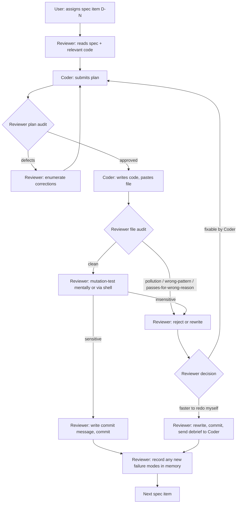

# Reviewer SOP — Plan / Code / Review / Commit Loop

**Purpose.** Codify the deterministic workflow used to ship Phase 5 of the
Cognitive OS governance foundation with an LLM coder (Cline) and a human
arbiter. The goal is interchangeability: any reviewer who follows this
SOP literally should produce the same accept/reject decisions on the
same submissions.

This is a workflow document. For Cline-model-specific tuning notes
(temperature, quants, etc.) see [`/memories/repo/cline_house_coder.md`](../../memories/repo/cline_house_coder.md).

---

## 1. Roles

Three actors. Each has exactly one decision authority. **Never combine roles.**

| Role | Decision authority | Cannot do |
|------|-------------------|-----------|
| **Coder** (Cline) | Implements plans. Reports findings. Asks clarifying questions. | Decide scope. Decide acceptance. Push to remote. |
| **Reviewer** (me/AI) | Approves plans. Audits code. Writes commits. Identifies prod bugs. Records failure modes. | Push to remote. Reassign work without user OK on destructive actions. |
| **User** | Defines the task. Authorizes pushes / destructive actions. Decides between A/B options when reviewer escalates. | (No restrictions, but should not skip plan-review gate.) |

If a single actor is doing two roles, the decisions made in the second role are not auditable. Don't.

---

## 2. The Loop (one cycle per spec item)



Spec item ≈ one bullet from the handoff. **Never bundle multiple spec items into one cycle.** Bundling defeats the audit gate.

---

## 3. Stage Contracts

### 3.1 Spec read

Before allowing a plan, the reviewer **reads the spec verbatim** from the handoff document — copy/paste the exact bullets. Memory or paraphrase is not acceptable; spec text is a contract.

### 3.2 Code read

Before allowing a plan, the reviewer **reads the actual implementation** of any module the test touches. Specifically:

- Public API signatures (`grep_search` for `def `, `class `).
- Module-level constants (these are the patch targets).
- Any side-effects in `__init__` methods (these need mocking).
- Exception types raised (assert on type, not message text).

If you skip this, you'll approve plans that hallucinate APIs. Symptom: plan says *"mock `X._foo`"* but `X` has no method `_foo` — caught at this stage cheap, otherwise burns a code cycle.

### 3.3 Plan audit (mandatory)

The reviewer must check the plan against these explicit contracts:

| Contract | Failure signal | Action |
|----------|---------------|--------|
| Spec scope is exactly N tests (usually 1) | Plan lists N+1 tests, optional cases, "baseline" tests, "edge cases" not in spec | Reject with "scope creep — N tests only" |
| Mocks named on the correct module | Plan says `monkeypatch("src.paths.X")` but `src.module_under_test` did `from src.paths import X` | Reject, re-target patches |
| Failure injection point matches the contract | Plan patches deep internal method when spec says exercise the public API; or patches public API when spec wants internal failure | Reject, re-pick injection point |
| Isolation covers every prod side-effect | Plan misses a writer, a sqlite, a flag cache | Reject, list missing isolation |
| Assertions check semantic state, not message text | Plan: `assert "Some Message" in str(e)` | Reject, switch to type/structural assertion |
| No accommodation of bug behavior | Plan asserts buggy output as expected | **STOP. Reviewer commits prod-code fix first. Then plan again against fixed behavior.** |

Plan must come back as a confirmation paragraph (not a re-statement). If the coder just re-states the plan in a long form, that's not engagement — re-prompt.

### 3.4 Code audit (mandatory)

For every file the coder submits, run this checklist **in order**. Halt on first failure.

```
1. `git status` — only the expected new/modified files? If extras → pollution; reject.
2. File path correct? (No nested cognitive-os/cognitive-os/ duplication?)
3. Read the entire file. Don't skim.
4. Imports: all symbols used are imported? No latent NameError?
5. Cleanup: tests with side effects have a `finally` block?
6. Assertion quality:
   - Negative assertion (no leak)?
   - Type-based, not message-text?
   - Would deleting the prod code break this test? (If not, it tests nothing.)
7. Run pytest on just the new file. Pass?
8. Run pytest on the full suite. Same pass count + the new test(s)?
9. `git status` again — still clean? No sqlite touched? No dev/proposals leaked?
10. Mutation test: revert/break the prod code this test claims to guard. Does the test FAIL?
```

If step 10 passes (test stays green after reverting prod code), the test is testing nothing. Reject.

### 3.5 Commit contract

Every commit follows this template. Multi-line `-m ""` separators break in PowerShell — write the message to `.git/COMMIT_MSG_<tag>.txt` and use `git commit -F`.

```
<type>(<scope>): <one-line summary in present imperative>

<one paragraph: what the commit does, what was wrong before>

<details if needed: file list, edge cases, regression-guard context>

<verification: "35/35 gates green. N tests pass (was N-k; this commit adds k).">
```

**Types:**
- `feat(phase5-XN):` for new spec deliverables
- `fix(<module>):` for production bug fixes
- `test(phase5-XN):` for tests of existing code
- `chore:` for tooling, never for prod code
- `docs:` for documentation only

**Hard rules:**

1. **One commit per logical change.** Never megacommit a bug-fix and its regression-test together — they go in separate commits (`fix` then `test`).
2. **No "WIP"** or `[skip ci]` commits.
3. **Each commit is independently mutation-validatable.** Reverting any single commit's prod code (not tests) should make at least one test fail.
4. **Pushes happen on user authorization only.** Accumulate locally. Push at clean breakpoints with explicit user OK.

---

## 4. Decision rules — reviewer takeover vs hand-back

The reviewer's hardest call: when to fix it yourself vs send back to the coder.

### Take over (rewrite myself)

- Coder produced a passing test that proves nothing (e.g. mock writer ignored router's destination, so routing wasn't actually tested).
- Coder accommodated a production bug in test assertions (e.g. asserted `"<uuid>.undo"` as expected suffix when real expected was `"<uuid>"`).
- Coder substituted a documented API with a heuristic (e.g. filename match instead of `OutputRouter.route()`).
- Coder polluted real production state in test runs (sqlite, real proposals dir, vault).
- Coder hung mid-task for > 15 min (model dynamics issue, not solvable by re-prompt).

In all these cases: I rewrite, commit, send a debrief that names the anti-pattern and shows the correct pattern. This is the only way the loop converges — re-prompting after a same-class failure trains nothing.

### Hand back to coder

- Plan has identifiable defects but no anti-patterns (just missing details).
- Test isolation is incomplete but the structure is right.
- Scope creep (5 tests instead of 3) — make him cut, don't cut for him.
- Naming, comment, or commit-message issues.
- First instance of a class of mistake.

### User escalation

- Destructive action needed (git push, force-rebase, schema migration, deleting a sibling-of-target staging dir at scale).
- Cline keeps repeating the same anti-pattern across 3+ cycles → escalate to user for model swap or workflow change.
- Spec is ambiguous; reviewer cannot decide A vs B.
- Test reveals a deeper architectural issue not in scope (file the finding, ask user whether to expand scope).

---

## 5. The "Production Bug Found During Testing" Protocol

This pattern fires often. The discipline is critical.

### Trigger

While writing a test, the coder (or reviewer) discovers that the production code behaves wrongly. Examples:
- Function name is misspelled (NameError on call).
- A method takes args in the order opposite to how callers pass them.
- A path-stem extraction strips only one suffix when two are present.
- A dead-letter file gets overwritten by a too-broad `except`.

### Wrong response

> "I noticed the bug and adjusted the test to expect the buggy output."

This locks in the bug as expected behavior. Every future regression test will preserve it. **Reject any submission that does this.**

### Correct response

Five steps, in order:

1. **STOP writing the test.** The current test is now contaminated with bug accommodation. Discard it.
2. **Diagnose** the bug. Find root cause, not just symptom.
3. **Commit the fix as its own commit.** `fix(<module>): ...` — production code only, no test changes. Verify gates + suite stay green.
4. **Write the test against the fixed behavior.** Assert what *should* be, not what *was*.
5. **Mutation-validate**: revert step 3 temporarily, confirm the new test fails. Restore step 3. Confirm test passes.

The bug fix and the regression test are **two separate commits**, in that order. The git log makes the causality explicit and any future bisect lands on the right commit.

---

## 6. The Mutation Test (mandatory before commit)

Before committing any test, prove it has signal.

### Procedure

1. Identify the specific prod behavior the test claims to guard.
2. Temporarily break that behavior (revert one line, flip a constant, comment out a function call).
3. Run the test. **Must fail.**
4. Restore the prod code.
5. Run the test. **Must pass.**

If step 3 passes anyway, the test is not testing what it claims. Either rewrite the test or delete it — a green-on-broken-code test is worse than no test (it provides false confidence and resists fixing the real bug).

### Quick mutation patterns

| Test type | Mutation |
|-----------|---------|
| Routing test | Remove the marker from the fixture content → assert should fail |
| Rollback test | Patch the failure injection to NOT raise → no-failure path should fail your "after rollback" assertion |
| Recovery test | Revert the recovery fix (e.g. re-introduce the typo) → all scenarios should fail |
| Migration test | Add a real marker to the supposedly-unclassifiable fixture → the manual_review assertion should fail |
| Veto test | Mock `transition()` to return `success=True` instead of `False` → the dead-letter assertion should fail |

For more complex tests, the mutation procedure is the same; just pick a single line of prod code whose change would invalidate the contract under test.

---

## 7. Memory Discipline

Three memory scopes. Use them deliberately.

### `/memories/repo/<topic>.md`

Repository-scoped facts. Examples used in this project:
- `cline_house_coder.md` — tested sampling settings, known failure modes per coder.
- `gui-ux-expert.agent.md` — design constraints.

**Update rules:**
- Add a new failure mode whenever a same-class mistake appears in ≥2 cycles.
- Remove or correct entries when behavior is observed to differ from what was recorded.

### `/memories/session/<task>.md`

Per-conversation working state. Examples:
- `phase5_status.md` — current commit graph, pending sections, recorded prod bugs found.

**Update rules:**
- Refresh after every accepted commit (so a context reset can resume the loop).
- Include unpushed-commit count so the next session knows whether to push.

### `/memories/<topic>.md` (user scope)

Persistent across all workspaces. Don't pollute with project-specific knowledge.

---

## 8. The Anti-pattern Taxonomy

When you see one of these, the response is in the table. Memorize this taxonomy or read it at every audit.

| Anti-pattern | Detection | Response |
|-------------|----------|---------|
| **Bug accommodation** | Test asserts current buggy output as expected (e.g. `assert "X.undo" in ...`) | STOP. Reviewer commits prod fix. Re-do test against fixed behavior. |
| **Mock that ignores its arguments** | Coder writes a `MockBackendWriter` whose `write(destination, content)` ignores `destination` | Reject. Force use of the real concrete class with redirected `base_dir`. |
| **API substitution** | Spec says use `OutputRouter.route()`; coder uses `'#marker' in content` heuristic | Reject. The spec'd API IS the contract. |
| **Scope creep** | N+1 tests, "edge cases," "baseline" tests not in spec | Reject. Cut to spec scope. |
| **Test bundling** | Multiple spec IDs (D2-D10) in one parametrized file | Reject. One file per spec ID. Parametrize ONLY within one logical scenario. |
| **Pollution** | `git status` shows `dev/decisions/index.sqlite`, real proposal files, etc. after test run | Identify the un-redirected path. Add monkeypatch. Re-run. |
| **Padding test** | A "test_xxx_cleanup" that exercises Python stdlib (`unlink`) rather than prod code | Delete. Add zero coverage. |
| **Status-claim mismatch** | Coder says "complete"; `git status` is dirty | Reject the report. Re-prompt for clean working tree. |
| **Credit confusion** | Coder claims a commit reviewer already made | Cross-check `git log origin/main..HEAD --author` before accepting status reports. |
| **Module-binding miss** | Patches `src.paths.X` when prod code did `from src.paths import X` at top of another module | Reject. Re-target the patch to the consuming module's local binding. |
| **Argparse-via-direct-call** | Test calls `main()` directly without setting `sys.argv` | Reject or accept-with-fix. Prefer importing the helper (e.g. `cmd_dry_run`) directly. |
| **Bare except hiding** | `except Exception: pass` or unconditional `try: ... except RuntimeError: pass` to "make the test pass" | Reject. The exception IS the test signal. |
| **Stem assumption** | Code/test assumes `Path("x.y.z").stem == "x"` (it's actually `"x.y"`) | Use `name.removesuffix(".y.z")` explicitly. |
| **Module-level execution** | Production code runs side-effects at module import (validators, sync checks) | Move into FastAPI `lifespan` or explicit init function. |
| **Hardcoded prod paths** | Module reads `Path("dev/...")` at import, no override hook | Accept `base_dir` parameter; derive sub-paths from it. |

---

## 9. Operational details (Windows / PowerShell specifics)

These bit us repeatedly:

- **Multi-line `git commit -m ""`**: PowerShell eats the empty separator and treats subsequent `-m` values as pathspecs. **Always** write the message to `.git/COMMIT_MSG_<tag>.txt` and use `git commit -F`.
- **`curl` aliases to `Invoke-WebRequest`**: doesn't accept `-s`. Use `Invoke-RestMethod` directly or escape.
- **`Path.rename()` on Windows raises `FileExistsError`** when target exists. Use `os.replace()` instead.
- **CRLF/LF drift**: `.gitattributes` must force LF on `*.md`, `*.yaml`, `*.json`, `*.py`. `core.autocrlf=true` will silently corrupt SHA-based snapshot tests.
- **`Path.cwd().name` is NOT a timestamp**. If it appears in a filename, it's a placeholder bug — flag and fix.
- **`os.getcwd()`-based fallbacks**: many libraries fall back to cwd when configured paths don't exist. For test isolation, set EVERY path explicitly.

---

## 10. Ending a session

Before user signs off:

1. `git status` clean (or all dirt explained).
2. `git log origin/main..HEAD --oneline` enumerated and approved for push by user.
3. 35-gate CI green: `python scripts/alpha_polish_check.py --phase all`.
4. Full pytest green: `python -m pytest tests/ -q`.
5. Session memory updated with:
   - Pending spec items (next D-section to start).
   - Outstanding prod-bug fixes not yet tested.
   - Any quarantined coder submissions (`/dev/.cline_rejected_*/`).
6. New failure modes recorded in `/memories/repo/cline_house_coder.md` if they appeared.

A session is **not** "done" because the coder said so. It's done when the gates are green, the tree is clean, and the next-action is written down.

---

## 11. Acceptance test for the SOP itself

If two reviewers follow this SOP independently on the same coder submission and reach different commit decisions, the SOP has a gap. Record the divergence and update the taxonomy or the loop until it converges.

The end state: any reviewer (human or LLM) reads this document, applies it to a fresh coder submission, and produces the same `accept` / `reject` / `take over` / `escalate to user` decision the original reviewer would have. That is interchangeability.

---

## Appendix A — Quick checklists

### Approve plan
- [ ] Spec items match (one D-section)
- [ ] Mock targets verified against actual module imports
- [ ] Isolation covers every prod side-effect
- [ ] No bug accommodation
- [ ] Assertion list specific (not "verify behavior")
- [ ] One-paragraph confirmation, not re-statement

### Approve code
- [ ] Working tree only has expected files
- [ ] Correct file path (no nested-dir bug)
- [ ] All assertions present per plan
- [ ] No padding tests
- [ ] Cleanup in `finally`
- [ ] No bare `except: pass`
- [ ] Pytest passes
- [ ] Mutation-test demonstrates sensitivity
- [ ] Working tree clean after run

### Commit
- [ ] `fix:` and `test:` are separate commits
- [ ] Commit message via `-F .git/COMMIT_MSG_<tag>.txt`
- [ ] Includes "35/35 gates green. N tests pass" line
- [ ] No push without user authorization
